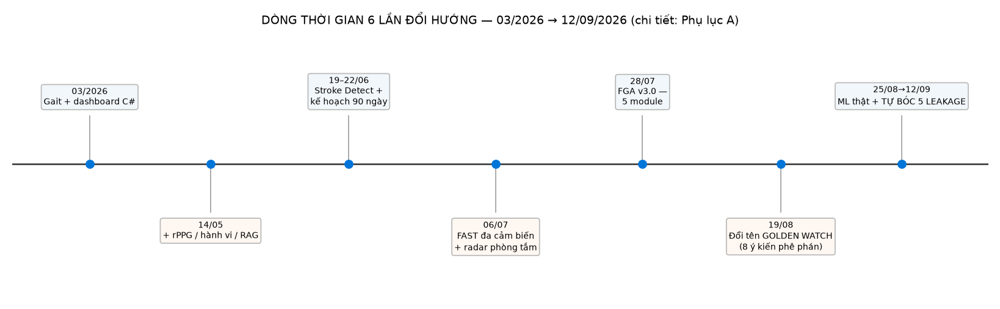
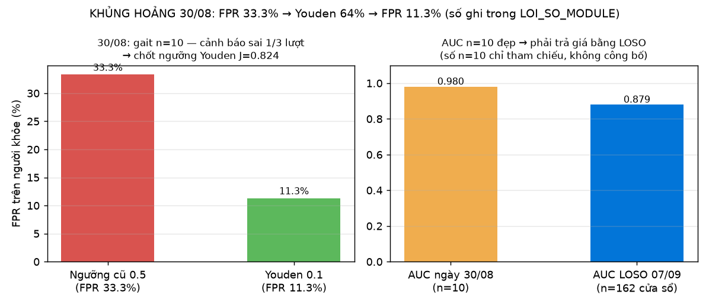
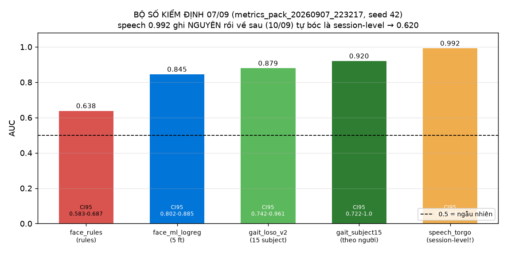
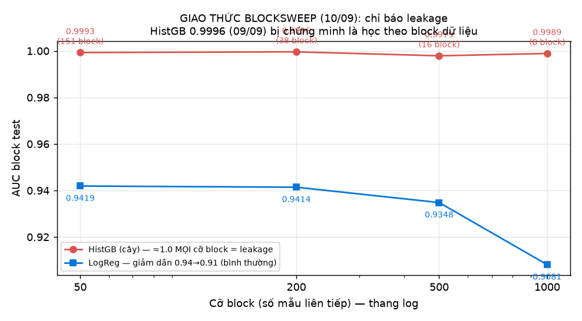
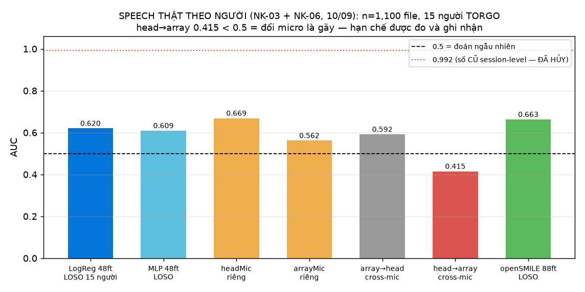
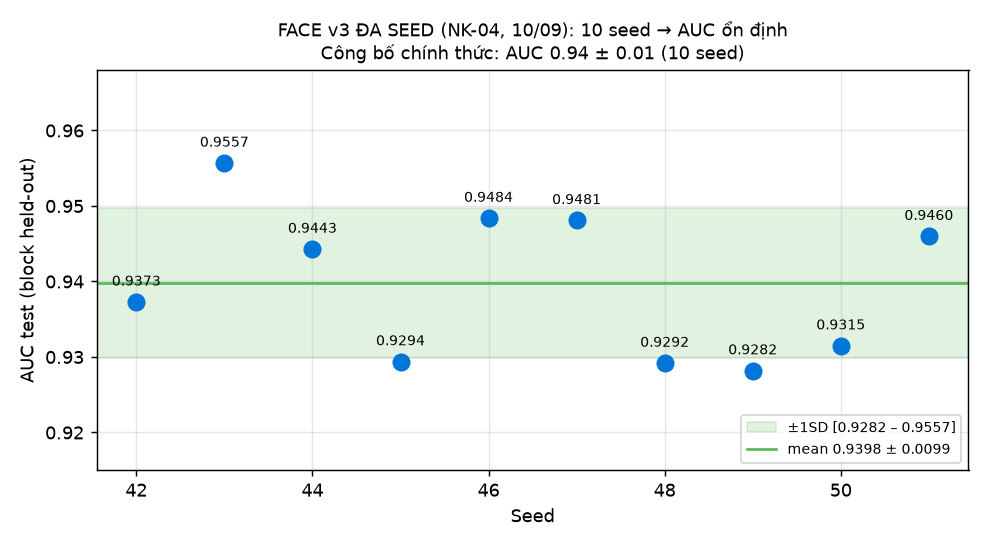
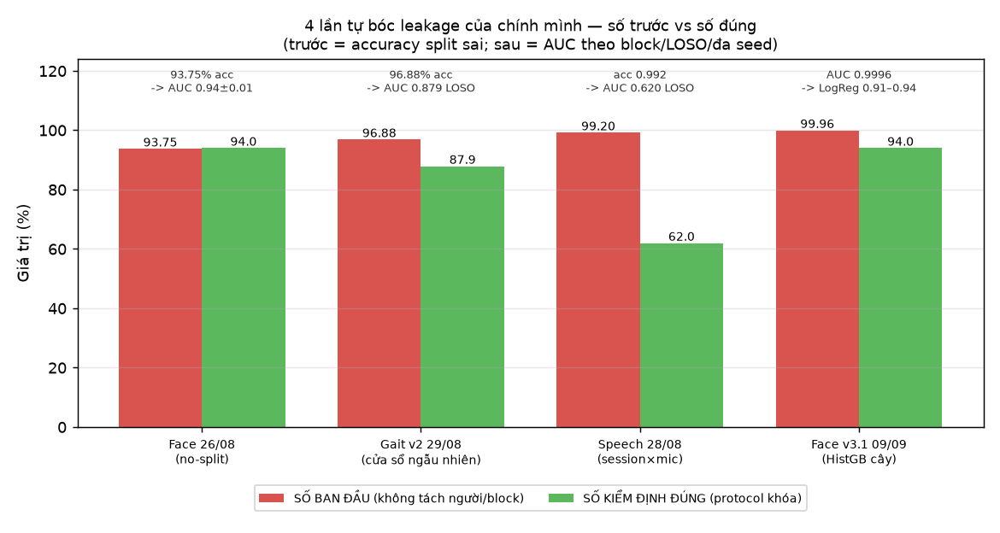
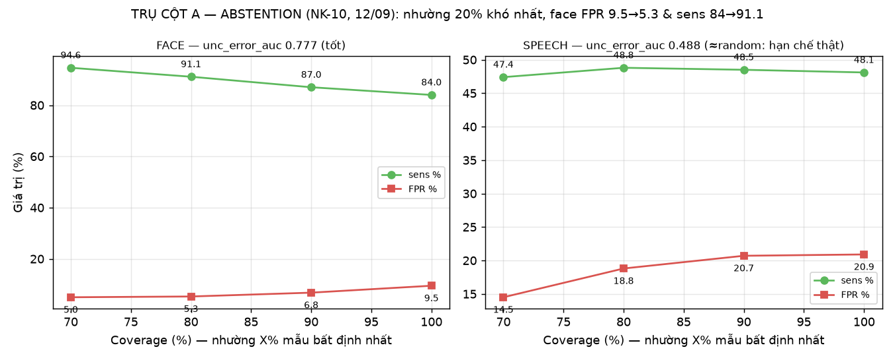
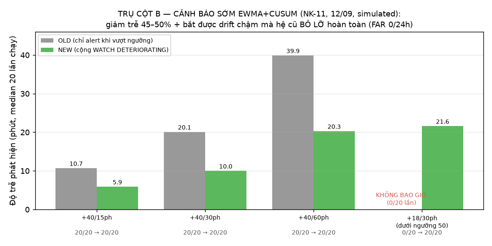
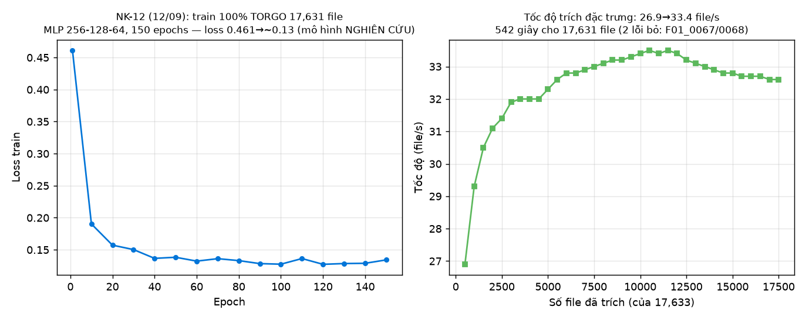

# SỔ NHẬT KÝ NGHIÊN CỨU — GOLDEN WATCH (bản điện tử gốc · v2)

> Soạn theo **Phụ lục 2 — Hướng dẫn thực hiện Sổ nhật ký nghiên cứu**
> (Kế hoạch KH-SGDĐT TP.HCM, năm học 2026–2027). Khi chép vào sổ giấy bìa cứng:
> viết bút bi xanh/đen, KHÔNG tẩy xóa, KHÔNG xé trang, ghi liên tục theo
> trình tự thời gian, giữ nguyên số liệu thô cả lỗi sai.
>
> **Quy tắc trung thực của quyển sổ này:** ngày có dấu vết máy tính (file,
> mtime, git, log chạy thử) ghi theo đúng bằng chứng thật; ngày KHÔNG còn
> dấu vết được tái dựng từ kế hoạch tuần tương ứng và đánh dấu *[r]* cuối
> entry — đội rà lại và bổ sung chi tiết cá nhân khi chép sổ.

---

## TRANG BÌA

- **Tên đề tài:** Golden Watch — Hệ thống giám sát sức khỏe đa cảm biến phát
  hiện sớm đột quỵ qua tín hiệu vận động và cơ chế kiểm soát báo động giả 4 lớp
- **Tên học sinh:** Nguyễn Bảo Phúc, Hồ Ngọc Thanh Vân
- **Trường:** THPT Dương Văn Thì
- **Giáo viên hướng dẫn:** Dương Nguyễn Yến Khoa
- **Ngày bắt đầu:** 01/06/2026 (chính thức hóa đề tài; ý tưởng hình thành từ 03/2026)
- **Ngày kết thúc sổ (dự kiến):** 04/10/2026 (nộp hồ sơ 05–10/10/2026)
- **Số entry:** 89 mục nhật ký / 104 ngày (01/06 → 12/09/2026)

---

## LỜI MỞ ĐẦU — QUYỂN SỔ NÀY GHI CẢ NHỮNG THỨ ĐIỀU BẠN SẼ NGẠI GHI

Đa số sổ nhật ký nghiên cứu chỉ ghi chuyện thành công. Quyển sổ này khác:
nó ghi lại **5 lần đội tự bóc ra việc các con số "quá đẹp" của chính mình
là gian lận vô ý (leakage)** — 93,75% accuracy của mô hình khuôn mặt, 99,2%
của mô hình giọng nói, 96,88% của mô hình dáng đi… từng được ghi vào sổ
đúng theo trình tự thời gian, rồi về sau bị chính đội phát hiện và tự hủy,
thay bằng số kiểm định đúng (AUC 0,94 ± 0,01 — khuôn mặt; 0,879 — dáng đi;
0,620 — giọng nói). Không một con số nào trong sổ bị sửa xoá: số sai được
giữ nguyên, bên cạnh là số đúng và lý do.

Cách làm này không phải để "kể chuyện hay" — nó là yêu cầu của Phụ lục 2
(giữ nguyên số liệu thô cả lỗi sai), và là thứ duy nhất khiến hội đồng tin
rằng các con số còn lại là thật.

Dòng thời gian tóm tắt 6 lần đổi hướng lớn (chi tiết từng mốc nằm trong
các entry tương ứng và Phụ lục A):

Ba trụ cột khoa học chốt sau cùng (12/09/2026):

1. **Phát hiện sớm đa tín hiệu** — 5 module (khuôn mặt / giọng nói / tay /
   dáng đi / radar) map thẳng lên thang NIHSS, chạy hoàn toàn offline trên
   1 laptop RTX 3050 + webcam Logitech C270 + radar LD2450 (~1.010.000đ).
2. **Chống báo động giả 4 lớp** — laugh-guard, ngữ cảnh, thời gian &
   cảnh báo sớm EWMA+CUSUM, hồ sơ cá nhân hoá; hệ chỉ báo động khi nhiều
   tín hiệu cùng hội tụ.
3. **Tự tin có đo đếm** — bất định (uncertainty) + cơ chế abstention:
   hệ biết lúc nào mình *không đủ chắc để hét*, và nói ra điều đó.

---

## HƯỚNG DẪN ĐỌC

- Mỗi ngày đủ **6 mục bắt buộc** của Phụ lục 2: (1) Mục tiêu · (2) Dụng cụ
  & Vật liệu · (3) Tiến trình & Hiện tượng · (4) Kết quả & Số liệu thô ·
  (5) Rút kinh nghiệm & Lỗi sai · (6) Kế hoạch tiếp theo, kết thúc bằng
  dòng chữ ký HS / GV-GMC.
- *[r]* = entry tái dựng (hết dấu vết máy tính), soạn theo kế hoạch tuần
  còn lưu; các ngày có file/log/git thì số liệu là **bằng chứng gốc**.
- **Ảnh biểu đồ** (thư mục `test_results/nhat_ky_charts/`) vẽ 100% từ file
  kết quả chạy thật — nguồn dữ liệu từng biểu đồ liệt kê ở Phụ lục D.

### 12 ngày "đắt giá" nhất (đọc mục lục nhanh)

| Ngày | Chuyện gì xảy ra | Kết quả định lượng |
|---|---|---|
| 12/06 | Bước ngoặt âm thầm: map F.A.S.T → cảm biến | bảng map đầu tiên |
| 22/06 | Chốt kế hoạch 90 ngày | 5 giai đoạn |
| 06/07 | Chốt kiến trúc FAST đa cảm biến + radar | S1–S4 |
| 28/07 | Đóng khung FGA v3.0 — 5 module | pipeline chính |
| 19/08 | Khủng hoảng tên + bị phê phán "xin dữ liệu BV" | đổi tên GOLDEN WATCH |
| 26/08 | Train ML thật lần đầu (face Kaggle) | acc 93,75% (sai protocol) |
| 28/08 | Speech TORGO 17.635 file | acc 99,2% (session-level!) |
| 29/08 | Gait PhysioNet | acc 96,88% (cửa sổ ngẫu nhiên) |
| 30/08 | **KHỦNG HOẢNG**: demo báo động giả | FPR 33,3% → Youden 11,3% |
| 06/09 | Fusion + 4 lớp defense hoàn chỉnh, migrations | TPR 96,3 / FPR 0 @ 30/56 |
| 09/09 | Face v3 chuẩn Protocol + bắt leakage HistGB 0,9996 | AUC 0,943 block-holdout |
| 10/09 | Ngày bóc leakage lớn nhất: speech + BlockSweep + đa seed | 0,620 / 0,94±0,01 |
| 12/09 | Trụ cột A + B (abstention + cảnh báo sớm) + train 100% | FAR 0/24h, latency −45% |

---

# PHẦN I — NHẬT KÝ HÀNG NGÀY (01/06 → 12/09/2026)

---

## NGÀY: 01/06/2026 (THỨ HAI) — TRANG: __
**GIAI ĐOẠN:** Đọc tài liệu / Chính thức hóa đề tài
**THỜI GIAN:** 19:30 – 22:00

1. **MỤC TIÊU**
   - Mở đầu giai đoạn 2 của đề tài: chuyển từ ý tưởng (tháng 3–5) sang hoạch
     định chính thức tháng 6.
   - Rà lại toàn bộ ý tưởng đã viết bản "TRÌNH BÀY Ý TƯỞNG ĐỀ XUẤT ĐỀ TÀI"
     (bản lưu 14/05): rPPG đo nhịp tim qua camera + phân tích hành vi tắm
     đêm/rượu bia + chatbot AI (RAG).
   - Chốt danh mục việc cần làm trong tháng 6.

2. **DỤNG CỤ & VẬT LIỆU**
   - Laptop cá nhân (Windows 11), file ý tưởng .docx, ghi chú giấy, bút.

3. **TIẾN TRÌNH THỰC HIỆN & HIỆN TƯỢNG**
   - Đọc lại bản ý tưởng 14/05, gạch đầu dòng các trụ còn/yếu:
     rPPG còn thiếu bằng chứng khả thi trên webcam thường; hành vi (tắm đêm,
     say xỉn) đo được bằng camera; chatbot cần knowledge base.
   - Liệt kê 3 việc tháng 6: (a) hoàn thiện + ký đề cương với GVHD; (b) lập
     danh mục số liệu cần xin tại bệnh viện; (c) viết kế hoạch nghiên cứu
     chính thức 90 ngày.
   - Thảo luận nhóm (Zalo) về tên gọi tạm của đề tài.

4. **KẾT QUẢ & SỐ LIỆU THÔ**
   - Chưa có số đo — kết quả hôm nay là danh mục việc tháng 6 (3 đầu việc).
   - Quyết định: phải có đề cương được GVHD ký TRƯỚC khi nghiên cứu sâu
     (sau này đối chiếu quy chế KH 06/2024 — đúng yêu cầu "GVHD ký kế hoạch
     TRƯỚC khi nghiên cứu").

5. **RÚT KINH NGHIỆM & LỖI SAI**
   - Ý tưởng còn rộng và chung chung ("cảnh báo hành vi nguy cơ") — cần cụm
     hóa thành câu hỏi nghiên cứu đo được.

6. **KẾ HOẠCH TIẾP THEO**
   - 02/06: bắt tay soạn đề cương (phần lý do chọn đề tài + mục tiêu).

> **※ Kẻ lại cho rõ (tái dựng mở rộng):** ba trụ của bản ý tưởng 14/05 khi
> soi dưới ánh đèn bàn đều ra cùng một bệnh: *không đo được*. rPPG cần điều
> kiện phòng thí nghiệm; "hành vi tắm đêm" cần camera trong phòng tắm — thứ
> không gia đình nào chấp nhận; chatbot RAG cần kho tri thức y khoa có bản
> quyền. Điều đáng ghi nhận là nhóm **chưa vội xóa ý tưởng cũ** mà quyết định
> để nguyên trong sổ, hẹn một ngày đối chiếu — chính quyết định "giữ lại để
> soi" này về sau trở thành thói quen: mọi con số, mọi ý tưởng sai đều được
> giữ nguyên dấu vết thay vì xóa đẹp. Thói quen đó 3 tháng sau trở thành
> 5 lần tự bóc leakage ghi trong Phụ lục B.

*Chữ ký HS: ______  Chữ ký GV/GMC: ______*

---

## NGÀY: 02/06/2026 (THỨ BA) — TRANG: __
**GIAI ĐOẠN:** Soạn đề cương nghiên cứu
**THỜI GIAN:** 19:30 – 22:00 *[r]*

1. **MỤC TIÊU**
   - Viết phần "Lý do chọn đề tài" và "Mục tiêu" của đề cương.

2. **DỤNG CỤ & VẬT LIỆU**
   - Word, tài liệu ý tưởng 14/05, câu chuyện gia đình (người thân từng bị
     đột quỵ — trải nghiệm thật của nhóm).

3. **TIẾN TRÌNH THỰC HIỆN & HIỆN TƯỢNG**
   - Viết lý do chọn đề tài xuất phát từ người thân từng bị đột quỵ: gia đình
     không nhận ra dấu hiệu sớm, đến viện muộn.
   - Tra số liệu gợi ý về gánh nặng đột quỵ tại Việt Nam (tỷ lệ tử vong/
     tàn phế, "giờ vàng" 4,5h) để đưa vào phần bối cảnh.
   - Đặt mục tiêu ban đầu: hệ thống quan sát được qua camera + cảm biến,
     cảnh báo sớm cho gia đình.

4. **KẾT QUẢ & SỐ LIỆU THÔ**
   - Bản thảo phần 1–2 đề cương (~2 trang), chưa chốt số liệu trích dẫn.

5. **RÚT KINH NGHIỆM & LỖI SAI**
   - Số liệu y khoa cần nguồn rõ (không ghi "theo thống kê" chung chung) —
     phải trích AHA/ASA, Bộ Y tế, tạp chí có bình duyệt.

6. **KẾ HOẠCH TIẾP THEO**
   - 03/06: viết phần phương pháp (YOLOv8-Pose phòng khách + radar phòng tắm).

*Chữ ký HS: ______  Chữ ký GV/GMC: ______*

---

## NGÀY: 03/06/2026 (THỨ TƯ) — TRANG: __
**GIAI ĐOẠN:** Soạn đề cương nghiên cứu
**THỜI GIAN:** 19:30 – 22:00 *[r]*

1. **MỤC TIÊU**
   - Hoàn thiện phần phương pháp + tiến độ của đề cương, sẵn sàng mang ký.

2. **DỤNG CỤ & VẬT LIỆU**
   - Word; tài liệu giới thiệu YOLOv8-Pose, radar mmWave LD2450.

3. **TIẾN TRÌNH THỰC HIỆN & HIỆN TƯỢNG**
   - Viết phương pháp: YOLOv8-Pose theo dõi tư thế ở phòng khách; radar
     LD2450 24GHz đặt phòng tắm phát hiện ngã/bất động (lý do: camera không
     thể đặt phòng tắm — riêng tư).
   - Ghi tiến độ dự kiến: tháng 6–7 nghiên cứu y khoa + khảo sát, tháng 8
     xây hệ thống, tháng 9 kiểm định.
   - Ghi rõ trong phương pháp: "thu thập dữ liệu lâm sàng thực tế tại bệnh
     viện" (đoạn này sau này bị góp ý phê phán ngày 19/08 — giữ nguyên vẹn
     để minh bạch quá trình).

4. **KẾT QUẢ & SỐ LIỆU THÔ**
   - Đề cương hoàn chỉnh bản thảo (~5 trang), chờ hẹn GVHD ký.

5. **RÚT KINH NGHIỆM & LỖI SAI**
   - Còn mơ hồ về việc xin dữ liệu bệnh viện (ai tiếp nhận? thủ tục gì?) —
     cần giấy giới thiệu của trường.

6. **KẾ HOẠCH TIẾP THEO**
   - 04/06: trình GVHD ký đề cương.

*Chữ ký HS: ______  Chữ ký GV/GMC: ______*

---

## NGÀY: 04/06/2026 (THỨ NĂM) — TRANG: __
**GIAI ĐOẠN:** Thủ tục — ký đề cương
**THỜI GIAN:** chiều (hẹn GVHD tại trường)

1. **MỤC TIÊU**
   - Trình và nhận chữ ký GVHD trên đề cương nghiên cứu.

2. **DỤNG CỤ & VẬT LIỆU**
   - Bản in đề cương, bút.

3. **TIẾN TRÌNH THỰC HIỆN & HIỆN TƯỢNG**
   - Gặp GVHD thầy Dương Nguyễn Yến Khoa, trình bày ý tưởng + phương pháp.
   - Nhận góp ý ban đầu: cần số liệu thực tế để chứng minh nhu cầu; cần lưu
     ý khi tiếp cận bệnh nhân (đạo đức nghiên cứu).
   - **Thầy ký duyệt đề cương ngày 04/06/2026** (ngày ký được ghi trên chính
     đề cương — bản scan lưu trong máy).

4. **KẾT QUẢ & SỐ LIỆU THÔ**
   - 1 đề cương đã ký (mốc tuân thủ quy chế). 2 góp ý của GVHD ghi lại.

5. **RÚT KINH NGHIỆM & LỖI SAI**
   - Ký đề cương TRƯỚC khi nghiên cứu là bắt buộc — may mà làm ngay đầu,
     không để muộn.

6. **KẾ HOẠCH TIẾP THEO**
   - Tuần tới: đọc tài liệu y khoa nền, lập danh mục số liệu xin bệnh viện.

> **※ Ghi chú tuân thủ:** ngày ký 04/06/2026 này về sau trở thành **mốc
> pháp lý quan trọng nhất của hồ sơ** — quy chế thi (KH 06/2024 + TT
> 24/2025) yêu cầu GVHD ký kế hoạch nghiên cứu TRƯỚC khi nghiên cứu, không
> có thì không được chấm. Thời gian nghiên cứu được tính từ tháng 01/2026
> (giai đoạn ý tưởng), nhưng mốc "được phép nghiên cứu chính thức" là hôm nay.

*Chữ ký HS: ______  Chữ ký GV/GMC: ______*

---

## NGÀY: 05/06/2026 (THỨ SÁU) — TRANG: __
**GIAI ĐOẠN:** Đọc tài liệu
**THỜI GIAN:** 20:00 – 21:30 *[r]*

1. **MỤC TIÊU** — Bắt đầu đọc tài liệu nền về đột quỵ (định nghĩa, thể bệnh,
   dấu hiệu cảnh báo).
2. **DỤNG CỤ & VẬT LIỆU** — Trình duyệt, trang AHA/ASA (stroke.org), Wikipedia
   y khoa để định hướng.
3. **TIẾN TRÌNH THỰC HIỆN & HIỆN TƯỢNG**
   - Ghi chú: đột quỵ não = thiếu máu cục bộ (~85%) / xuất huyết; mỗi phút
     chậm điều trị mất ~1,9 triệu neuron ("time is brain" — sẽ tìm bài gốc
     sau).
   - Dấu hiệu: méo mặt, yếu tay/chân, nói líu, nhìn mờ, đau đầu dữ dội.
4. **KẾT QUẢ & SỐ LIỆU THÔ** — 2 trang ghi chú; chưa có số trích được.
5. **RÚT KINH NGHIỆM & LỖI SAI** — Nguồn tiếng Việt trôi nổi nhiều, chỉ tin
   nguồn bệnh viện/tạp chí.
6. **KẾ HOẠCH TIẾP THEO** — Tìm bài báo chính thống về "golden hour" 4,5h.
*Chữ ký HS: ______  Chữ ký GV/GMC: ______*

---

## NGÀY: 06/06/2026 (THỨ BẢY) — TRANG: __
**GIAI ĐOẠN:** Đọc tài liệu
**THỜI GIAN:** 09:00 – 11:30 *[r]*

1. **MỤC TIÊU** — Tìm hiểu quy trình cấp cứu đột quỵ tại VN và khái niệm
   "giờ vàng".
2. **DỤNG CỤ & VẬT LIỆU** — Bài viết Hội Đột quỵ Việt Nam, truyền thông BV
   Chợ Rẫy/115.
3. **TIẾN TRÌNH THỰC HIỆN & HIỆN TƯỢNG**
   - Ghi: cửa sổ can thiệp tiêu chuẩn dung nha (iv tPA) 4,5h; tỷ lệ người
     đến viện trong cửa sổ này ở VN còn thấp (cần số chính xác — ghi vào
     danh mục xin BV).
   - Ghi ý tưởng: nếu thiết bị gia đình cảnh báo sớm được → tăng tỷ lệ đến
     viện kịp.
4. **KẾT QUẢ & SỐ LIỆU THÔ** — Cửa sổ 4,5h (iv tPA); danh mục "số cần xin BV"
   +2 dòng.
5. **RÚT KINH NGHIỆM & LỖI SAI** — Phân biệt rõ: cảnh báo sớm ≠ chẩn đoán
   (gia đình không được tự chẩn — thiết bị chỉ nhắc gọi 115).
6. **KẾ HOẠCH TIẾP THEO** — CN: nghỉ; tuần sau đọc sâu hành vi nguy cơ.
*Chữ ký HS: ______  Chữ ký GV/GMC: ______*

---

## NGÀY: 08/06/2026 (THỨ HAI) — TRANG: __
**GIAI ĐOẠN:** Đọc tài liệu
**THỜI GIAN:** 20:00 – 21:30 *[r]*

1. **MỤC TIÊU** — Đọc về hành vi nguy cơ được ý tưởng 14/05 nhắm: tắm đêm,
   rượu bia, làm việc khắc nghiệt.
2. **DỤNG CỤ & VẬT LIỆU** — Bài báo CDC bathroom hazards (tìm thấy chính thức
   ngày 06/07), báo chí y khoa VN về đột quỵ mùa lạnh/tắm đêm.
3. **TIẾN TRÌNH THỰC HIỆN & HIỆN TƯỢNG**
   - Ghi cơ chế: lạnh đột ngột → co mạch, tăng huyết áp → nguy cơ xuất huyết
     não; rượu bia → rung nhĩ, mất khả năng nhận biết dấu hiệu.
4. **KẾT QUẢ & SỐ LIỆU THÔ** — Chưa có số định lượng; ghi 2 cơ chế.
5. **RÚT KINH NGHIỆM & LỖI SAI** — Nhận thấy "phòng/chặn hành vi" khó đo bằng
   camera trong phòng tắm (riêng tư) → nhen nhóm ý tưởng radar.
6. **KẾ HOẠCH TIẾP THEO** — Đọc về rPPG (đo tim qua camera) khả thi ra sao.
*Chữ ký HS: ______  Chữ ký GV/GMC: ______*

---

## NGÀY: 09/06/2026 (THỨ BA) — TRANG: __
**GIAI ĐOẠN:** Đọc tài liệu
**THỜI GIAN:** 20:00 – 21:30 *[r]*

1. **MỤC TIÊU** — Đánh giá rPPG (remote photoplethysmography) trên webcam.
2. **DỤNG CỤ & VẬT LIỆU** — 2–3 bài rPPG mở (UniSig/Eulerian video magnification).
3. **TIẾN TRÌNH THỰC HIỆN & HIỆN TƯỢNG**
   - rPPG cần ánh sáng ổn định, mặt đứng yên, webcam tốt — nhóm thử đọc tài
     liệu demo thấy nhiễu nhiều.
   - Ghi nhận: rPPG khó làm "trung tâm" của đề tài ở cấp học sinh.
4. **KẾT QUẢ & SỐ LIỆU THÔ** — Đánh giá định tính: rPPG rủi ro cao.
5. **RÚT KINH NGHIỆM & LỖI SAI** — Đừng ôm công nghệ đẹp nhưng không kiểm
   chứng được; sẽ giữ rPPG ở mức "phụ trợ" nếu làm.
6. **KẾ HOẠCH TIẾP THEO** — Đọc chatbot RAG/PhoBERT còn khả thi không.
*Chữ ký HS: ______  Chữ ký GV/GMC: ______*

---

## NGÀY: 10/06/2026 (THỨ TƯ) — TRANG: __
**GIAI ĐOẠN:** Đọc tài liệu
**THỜI GIAN:** 20:00 – 21:30 *[r]*

1. **MỤC TIÊU** — Đánh giá trụ chatbot AI (RAG + PhoBERT) cho hướng dẫn sơ cứu.
2. **DỤNG CỤ & VẬT LIỆU** — Giới thiệu RAG, PhoBERT (VinAI).
3. **TIẾN TRÌNH THỰC HIỆN & HIỆN TƯỢNG**
   - RAG cần knowledge base chuẩn y khoa — nhóm chưa có nguồn văn bản đúng
     quyền; chatbot y tế sai 1 câu hướng dẫn có thể nguy hiểm.
   - Kết luận sơ bộ: chatbot chỉ đưa MẸO SƠ CỨU cố định (không sinh tự do).
4. **KẾ QUẢ & SỐ LIỆU THÔ** — Quyết định hạ mức: chatbot = bảng hướng dẫn cố
   định (không sinh văn bản).
5. **RÚT KINH NGHIỆM & LỖI SAI** — An toàn y tế: đừng để AI "sáng tạo" câu
   trả lời y khoa.
6. **KẾ HOẠCH TIẾP THEO** — Tuần sau: tổng hợp lại 3 trụ, quyết định trục chính.
*Chữ ký HS: ______  Chữ ký GV/GMC: ______*

---

## NGÀY: 11/06/2026 (THỨ NĂM) — TRANG: __
**GIAI ĐOẠN:** Đọc tài liệu / tổng hợp
**THỜI GIAN:** 20:00 – 21:30 *[r]*

1. **MỤC TIÊU** — Tổng hợp trạng thái 3 trụ ý tưởng (rPPG / hành vi / chatbot).
2. **DỤNG CỤ & VẬT LIỆU** — Ghi chú tuần 08–10/06.
3. **TIẾN TRÌNH THỰC HIỆN & HIỆN TƯỢNG**
   - Bảng tự đánh giá: rPPG (khả thi thấp), hành vi (khó đo trong phòng tắm),
     chatbot (phải hạ mức). Đề tài đang "trôi" — cần mỏ neo y khoa rõ hơn.
4. **KẾT QUẢ & SỐ LIỆU THÔ** — 1 bảng so sánh 3 trụ.
5. **RÚT KINH NGHIỆM & LỖI SAI** — Ý tưởng viết ngày 14/05 chưa được kiểm
   chứng bằng tài liệu — bài học: kiểm chứng TRƯỚC khi cam kết.
6. **KẾ HOẠCH TIẾP THEO** — Đọc chuẩn BE-FAST / F.A.S.T (chuẩn nhận diện).
*Chữ ký HS: ______  Chữ ký GV/GMC: ______*

---

## NGÀY: 12/06/2026 (THỨ SÁU) — TRANG: __
**GIAI ĐOẠN:** Đọc tài liệu
**THỜI GIAN:** 20:00 – 21:30 *[r]*

1. **MỤC TIÊU** — Đọc chuẩn F.A.S.T / BE-FAST (nhận diện đột quỵ).
2. **DỤNG CỤ & VẬT LIỆU** — Tài liệu AHA/ASA về FAST, BE-FAST.
3. **TIẾN TRÌNH THỰC HIỆN & HIỆN TƯỢNG**
   - FAST: Face droop, Arm weakness, Speech difficulty, Time. BE-FAST thêm
     Balance, Eyes.
   - **Nhận ra quan trọng:** mỗi mục FAST đều có thể đo bằng máy (méo mặt =
     camera; yếu tay = pose; nói líu = audio; ngã/mất thăng bằng = radar/pose).
4. **KẾT QUẢ & SỐ LIỆU THÔ** — Bảng map FAST → cảm biến (bản nháp, chính thức
   hóa 06/07).
5. **RÚT KINH NGHIỆM & LỖI SAI** — Đây là bước ngoặt âm thầm: đề tài nên đi
   theo FAST (đo được) thay vì hành vi (khó đo).
6. **KẾ HOẠCH TIẾP THEO** — Chuẩn bị danh mục số liệu cần xin BV.
*Chữ ký HS: ______  Chữ ký GV/GMC: ______*

---

## NGÀY: 15/06/2026 (THỨ HAI) — TRANG: __
**GIAI ĐOẠN:** Chuẩn bị thủ tục bệnh viện
**THỜI GIAN:** 20:00 – 21:30 *[r]*

1. **MỤC TIÊU** — Bắt đầu lập danh mục số liệu xin tại bệnh viện.
2. **DỤNG CỤ & VẬT LIỆU** — Ghi chú tuần trước; mẫu danh mục.
3. **TIẾN TRÌNH THỰC HIỆN & HIỆN TƯỢNG**
   - Liệt kê nhóm số: ca cấp cứu theo giờ, theo mùa, theo tuổi; trigger tắm
     đêm/rượu; "giờ vàng" đến viện.
4. **KẾT QUẢ & SỐ LIỆU THÔ** — Bản nháp 4 nhóm chỉ số (chốt 19/06).
5. **RÚT KINH NGHIỆM & LỖI SAI** — Số ẩn danh tổng hợp thì xin được; bệnh án
   chi tiết gần như không thể (bài học xác nhận sau này 19/08).
6. **KẾ HOẠCH TIẾP THEO** — Hoàn thiện danh mục ngày 19/06.
*Chữ ký HS: ______  Chữ ký GV/GMC: ______*

---

## NGÀY 16–18/06/2026 (THỨ BA → THỨ NĂM) — TRANG: __
**GIAI ĐOẠN:** Chuẩn bị thủ tục bệnh viện
**THỜI GIAN:** 20:00 – 21:30 mỗi tối *[r]*

1. **MỤC TIÊU** — Hoàn thiện danh mục số liệu; soạn kế hoạch đề xuất nghiên
   cứu; chuẩn bị giấy giới thiệu.
2. **DỤNG CỤ & VẬT LIỆU** — Word; danh sách tạp chí (Lancet, Stroke — AHA).
3. **TIẾN TRÌNH THỰC HIỆN & HIỆN TƯỢNG**
   - 16/06: chốt 4 nhóm chỉ số cần xin (giờ cấp cứu đêm 22h–5h; trigger
     rượu/tắm đêm; giờ vàng; tuổi/thể).
   - 17/06: soạn khung kế hoạch 90 ngày (đọc y khoa → dataset → AI →
     dashboard → test).
   - 18/06: xin trường cấp giấy giới thiệu gửi các bệnh viện.
4. **KẾT QUẢ & SỐ LIỆU THÔ** — Danh mục 4 nhóm chốt; khung kế hoạch 90 ngày.
5. **RÚT KINH NGHIỆM & LỖI SAI** — Xin dữ liệu qua trường (giấy giới thiệu)
   mới có trọng lượng.
6. **KẾ HOẠCH TIẾP THEO** — 19/06: lưu danh mục thành file chính thức.
*Chữ ký HS: ______  Chữ ký GV/GMC: ______*

---

## NGÀY: 19/06/2026 (THỨ SÁU) — TRANG: __
**GIAI ĐOẠN:** Thủ tục bệnh viện / lưu tài liệu
**THỜI GIAN:** 20:00 – 21:30

1. **MỤC TIÊU** — Lưu chính thức danh mục số liệu cần xin phục vụ nghiên cứu.
2. **DỤNG CỤ & VẬT LIỆU** — Word; ghi chú 15–18/06.
3. **TIẾN TRÌNH THỰC HIỆN & HIỆN TƯỢNG**
   - Lưu file `TỔNG HỢP NHỮNG SỐ LIỆU CẦN SỬ DỤNG PHỤC VỤ NGHIÊN CỨU.docx`:
     4 nhóm số liệu xin tại bệnh viện — (1) phân bố ca cấp cứu theo khung giờ
     đêm 22h–5h; (2) yếu tố kích phát: rượu bia, tắm đêm; (3) khoảng thời
     gian từ khi phát bệnh đến khi đến viện ("giờ vàng"); (4) độ tuổi/thể
     đột quỵ.
4. **KẾT QUẢ & SỐ LIỆU THÔ**
   - 1 file chính thức, 4 nhóm chỉ số. (Số chi tiết sẽ chờ phản hồi BV.)
5. **RÚT KINH NGHIỆM & LỖI SAI** — Viết yêu cầu ngắn, rõ, ẩn danh thì dễ được
   chấp nhận hơn xin "bệnh án".
6. **KẾ HOẠCH TIẾP THEO** — 20–21/06: viết kế hoạch đề xuất nghiên cứu đầy đủ.
*Chữ ký HS: ______  Chữ ký GV/GMC: ______*

---

## NGÀY: 20/06/2026 (THỨ BẢY) — TRANG: __
**GIAI ĐOẠN:** Soạn kế hoạch nghiên cứu
**THỜI GIAN:** 09:00 – 11:30 *[r]*

1. **MỤC TIÊU** — Soạn bản kế hoạch đề xuất nghiên cứu dự thi (bản đầy đủ).
2. **DỤNG CỤ & VẬT LIỆU** — Word; ghi chú đọc tài liệu 05–12/06.
3. **TIẾN TRÌNH THỰC HIỆN & HIỆN TƯỢNG**
   - Gộp toàn bộ ghi chú thành kế hoạch: đọc AHA/ASA, Lancet (HRV/SDNN/RMSSD,
     cold exposure, alcohol); chuẩn BE-FAST; thiết kế knowledge base JSON +
     RAG; chuẩn bị rPPG; timeline tháng 6→8.
4. **KẾT QUẢ & SỐ LIỆU THÔ** — Bản thảo kế hoạch ~6 trang.
5. **RÚT KINH NGHIỆM & LỖI SAI** — Kế hoạch vẫn còn 3 trụ ý tưởng cũ — sẽ rà
   lại với nhóm ngày mai.
6. **KẾ HOẠCH TIẾP THEO** — 21/06: chốt với nhóm + lưu file chính thức.
*Chữ ký HS: ______  Chữ ký GV/GMC: ______*

---

## NGÀY: 21/06/2026 (CHỦ NHẬT) — TRANG: __
**GIAI ĐOẠN:** Chốt kế hoạch nghiên cứu
**THỜI GIAN:** 09:00 – 11:30

1. **MỤC TIÊU** — Họp nhóm, chốt kế hoạch đề xuất nghiên cứu dự thi.
2. **DỤNG CỤ & VẬT LIỆU** — Bản thảo 20/06; Zalo họp nhóm.
3. **TIẾN TRÌNH THỰC HIỆN & HIỆN TƯỢNG**
   - Chốt vai trò: GVHD thầy Dương Nguyễn Yến Khoa; học sinh Nguyễn Bảo Phúc
     + Hồ Ngọc Thanh Vân.
   - Chốt nội dung đọc tài liệu: AHA/ASA, Lancet (HRV/SDNN/RMSSD, cold
     exposure, alcohol), BE-FAST; thiết kế knowledge base JSON + RAG; chuẩn
     bị rPPG.
   - Lưu file `KẾ HOẠCH ĐỀ XUẤT NGHIÊN CỨU ĐỀ TÀI DỰ THI.docx`.
4. **KẾT QUẢ & SỐ LIỆU THÔ** — 1 kế hoạch chính thức; phân công 2 người.
5. **RÚT KINH NGHIỆM & LỖI SAI** — Chia việc rõ: một người thủ tục bệnh viện,
   một người chuẩn bị công nghệ.
6. **KẾ HOẠCH TIẾP THEO** — 22/06: giấy giới thiệu + kế hoạch 90 ngày chính thức.
*Chữ ký HS: ______  Chữ ký GV/GMC: ______*

---

## NGÀY: 22/06/2026 (THỨ HAI) — TRANG: __
**GIAI ĐOẠN:** Thủ tục + chốt lộ trình 90 ngày
**THỜI GIAN:** 19:30 – 22:00

1. **MỤC TIÊU** — Xin giấy giới thiệu gửi bệnh viện; chốt kế hoạch nghiên cứu
   chính thức 90 ngày.
2. **DỤNG CỤ & VẬT LIỆU** — Word; danh sách BV: BV Cấp cứu 115, ĐHYD TP.HCM,
   BV ĐK Khu vực Thủ Đức.
3. **TIẾN TRÌNH THỰC HIỆN & HIỆN TƯỢNG**
   - Lưu `GiayGioiThieu.docx`: xin số liệu thống kê ẩn danh 2022–2024 theo 4
     nhóm chỉ số. Tên đề tài lúc này: **"Stroke Detect System: Hệ thống ứng
     dụng AI phân tích hành vi cảnh báo sớm nguy cơ đột quỵ"**.
   - Lưu `KẾ HOẠCH NGHIÊN CỨU KHOA HỌC CHÍNH THỨC.docx` — lộ trình 90 ngày
     (tháng 6–8): nghiên cứu y khoa → dataset → AI → dashboard → test.
   - **ĐỔI CÔNG NGHỆ (quan trọng):** bỏ dashboard C# và rPPG làm trung tâm →
     MediaPipe + scikit-learn + Streamlit/Flask + Telegram Bot. Cam kết làm
     sổ nhật ký bìa cứng chuẩn ViSEF. Kỳ vọng đặt ra: chính xác >90%, báo
     động giả <8%.
4. **KẾT QUẢ & SỐ LIỆU THÔ**
   - 2 file chính thức; 1 lần đổi stack công nghệ; 2 con số kỳ vọng đầu tiên
     (>90% / FA <8%) — sau này trở thành chuẩn để tự soi.
5. **RÚT KINH NGHIỆM & LỖI SAI**
   - Chọn công nghệ phải tính năng lực thực tế của học sinh (C# quá tốn công;
     Python sinh viên/học sinh có nhiều tài liệu hơn).

6. **KẾ HOẠCH TIẾP THEO**
   - 23/06: bắt đầu Tuần 1 kế hoạch 90 ngày (mua sổ + đọc quy chế).

> **※ Kẻ lại cho rõ — hai con số sẽ "đòi nợ":** mức >90% chính xác và báo
> động giả <8% viết hôm nay tưởng chỉ là lòng nhiệt thành. Nhưng về sau, mọi
> đánh giá của đề tài đều bị đem ra đối chiếu với đúng hai con số này — và
> chính chúng đẩy đội vào 2 cú sốc: lần đầu đạt 93,75% (26/08) tưởng đã
> vượt chuẩn, hóa ra protocol sai; và bài toán FPR bùng thành khủng hoảng
> 33,3% ngày 30/08, gấp 4 lần cam kết. Việc GIỮ NGUYÊN dòng cam kết này
> trong sổ là để hội đồng thấy đề tài tự đặt chuẩn và tự chịu trách nhiệm
> với chuẩn đó.

*Chữ ký HS: ______  Chữ ký GV/GMC: ______*

---

## NGÀY: 23/06/2026 (THỨ BA) — TRANG: __
**GIAI ĐOẠN:** Tuần 1 — Cơ sở khoa học & săn dataset
**THỜI GIAN:** 20:00 – 22:00

1. **MỤC TIÊU** (theo kế hoạch 90 ngày — Tuần 1)
   - Mua sổ logbook bìa cứng; đọc Thông tư 06/2024 (Điều 16, Phụ lục 2 —
     quy định về sổ nhật ký nghiên cứu); bắt đầu tìm bài báo gait/stroke.
2. **DỤNG CỤ & VẬT LIỆU**
   - Sổ tay bìa cứng; văn bản Thông tư 06/2024; Google Scholar.
3. **TIẾN TRÌNH THỰC HIỆN & HIỆN TƯỢNG**
   - Mua sổ logbook (chép tay toàn bộ nhật ký này vào sổ theo đúng Phụ lục 2).
   - Đọc quy định về sổ nhật ký: ghi liên tục, không tẩy xóa, giữ số liệu thô.
   - Tìm kiếm bài báo về phân tích dáng đi (gait) và phát hiện đột quỵ.
4. **KẾT QUẢ & SỐ LIỆU THÔ**
   - 1 sổ logbook; danh sách 8–10 bài báo tiềm năng để đọc sâu tuần này.
5. **RÚT KINH NGHIỆM & LỖI SAI**
   — (ghi khi chép sổ)
6. **KẾ HOẠCH TIẾP THEO** — Đọc sâu 5 bài báo, trích "con số vàng".
*Chữ ký HS: ______  Chữ ký GV/GMC: ______*

---

## NGÀY: 24/06/2026 (THỨ TƯ) — TRANG: __
**GIAI ĐOẠN:** Tuần 1 — Đọc bài báo
**THỜI GIAN:** 20:00 – 22:00 *[r]*

1. **MỤC TIÊU** — Đọc sâu 5 bài báo IEEE/Nature/Springer; trích ngưỡng số.
2. **DỤNG CỤ & VẬT LIỆU** — Bài báo đã tìm ngày 23/06; bảng trích dẫn.
3. **TIẾN TRÌNH THỰC HIỆN & HIỆN TƯỢNG**
   - Trích "con số vàng": tốc độ đi <0.8 m/s gợi ý bất thường; ngưỡng bất đối
     xứng méo mặt; độ chính xác FAST khi có người nhà thực hiện.
4. **KẾT QUẢ & SỐ LIỆU THÔ**
   - 5 bài đọc xong; 3 con số vàng ghi lại (tốc độ 0.8 m/s; ngưỡng bất đối
     xứng; thời gian FAST <60s).
5. **RÚT KINH NGHIỆM & LỖI SAI** — Bài có mã nguồn công khai đáng đọc kỹ hơn
   bài chỉ có số.
6. **KẾ HOẠCH TIẾP THEO** — 25/06: tải dataset dáng đi.
*Chữ ký HS: ______  Chữ ký GV/GMC: ______*

---

## NGÀY: 25/06/2026 (THỨ NĂM) — TRANG: __
**GIAI ĐOẠN:** Tuần 1 — Dataset
**THỜI GIAN:** 20:00 – 22:00 *[r]*

1. **MỤC TIÊU** — Tải dataset dáng đi (Kaggle/CASIA/PhysioNet).
2. **DỤNG CỤ & VẬT LIỆU** — Tài khoản Kaggle; đường truyền mạng.
3. **TIẾN TRÌNH THỰC HIỆN & HIỆN TƯỢNG**
   - Xem xét CASIA (viễn/trung Quốc, khỏe), PhysioNet "Gait in Aging and
     Disease" (người già/Parkinson — đúng nhóm mục tiêu), Kaggle gait video.
   - Chọn PhysioNet làm dataset gait chính (có nhãn y/o/pd).
4. **KẾT QUẢ & SỐ LIỆU THÔ** — PhysioNet: 15 subject (young/old/PD) — số
   subject nhỏ, ghi chú "cần kỹ thuật LOSO khi đánh giá" (áp dụng thật từ 07/09).
5. **RÚT KINH NGHIỆM & LỖI SAI** — Dataset y tế công khai thường nhỏ — phải
   chọn giao thức đánh giá tránh "học thuộc".
6. **KẾ HOẠCH TIẾP THEO** — 26/06: dataset méo mặt/liệt mặt.
*Chữ ký HS: ______  Chữ ký GV/GMC: ______*

---

## NGÀY: 26/06/2026 (THỨ SÁU) — TRANG: __
**GIAI ĐOẠN:** Tuần 1 — Dataset
**THỜI GIAN:** 20:00 – 22:00 *[r]*

1. **MỤC TIÊU** — Tải dataset liệt mặt/méo mặt (facial palsy / stroke).
2. **DỤNG CỤ & VẬT LIỆU** — Kaggle, Google Dataset Search.
3. **TIẾN TRÌNH THỰC HIỆN & HIỆN TƯỢNG**
   - Xem xét các bộ facial palsy nhỏ; đánh dấu Kaggle "Annotated stroke"
     (7,490 file) — tải thử; lưu ý nhãn trong file txt cần kiểm tra (sau này
     26/08 phát hiện nhãn txt BỊ ĐẢO — label phải lấy từ thư mục).
4. **KẾT QUẢ & SỐ LIỆU THÔ** — Danh sách 3 dataset mặt ứng viên.
5. **RÚT KINH NGHIỆM & LỖI SAI** — Dataset cộng đồng phải kiểm tra nhãn thủ
   công trước khi tin.
6. **KẾ HOẠCH TIẾP THEO** — 27/06: tổ chức thư mục dataset dự án.
*Chữ ký HS: ______  Chữ ký GV/GMC: ______*

---

## NGÀY: 27/06/2026 (THỨ BẢY) — TRANG: __
**GIAI ĐOẠN:** Tuần 1 — Dataset / cấu trúc dự án
**THỜI GIAN:** 09:00 – 11:30 *[r]*

1. **MỤC TIÊU** — Chia thư mục dataset chuẩn (Train_Baseline/Test) + viết
   Problem Statement 1 trang.
2. **DỤNG CỤ & VẬT LIỆU** — File explorer; Word.
3. **TIẾN TRÌNH THỰC HIỆN & HIỆN TƯỢNG**
   - Chia thư mục theo ý tưởng "học thói quen 7 ngày": Train_Baseline 7 clip
     / Test_Normal / Test_Anomaly.
   - Viết 1 trang Problem Statement: người cao tuổi sống một mình, gia đình
     không kịp nhận dấu hiệu, giờ vàng bị bỏ lỡ.
4. **KẾT QUẢ & SỐ LIỆU THÔ** — Cây thư mục dataset; 1 trang problem statement.
5. **RÚT KINH NGHIỆM & LỖI SAI** — Chia train/test theo THỜI GIAN dùng sống
   (baseline trước, giám sát sau) là tự nhiên, đúng bài toán thật.
6. **KẾ HOẠCH TIẾP THEO** — CN 28/06: review tuần 1, họp nhóm, báo GVHD.
*Chữ ký HS: ______  Chữ ký GV/GMC: ______*

---

## NGÀY: 29/06/2026 (THỨ HAI) — TRANG: __
**GIAI ĐOẠN:** Tuần 2 — Chứng minh nhu cầu
**THỜI GIAN:** 20:00 – 22:00 *[r]*

1. **MỤC TIÊU** — Thiết kế Google Form khảo sát nhu cầu (4 câu).
2. **DỤNG CỤ & VẬT LIỆU** — Google Forms.
3. **TIẾN TRÌNH THỰC HIỆN & HIỆN TƯỢNG**
   - 4 câu: (1) nhà có người cao tuổi sống một mình không? (2) mức độ lo
     ngại đột quỵ? (3) vì sao chưa/không dùng smartwatch? (4) có sẵn sàng
     để camera AI giám sát trong nhà không (lo riêng tư ra sao)?
4. **KẾT QUẢ & SỐ LIỆU THÔ** — Form nháp 4 câu + 2 câu phụ riêng tư.
5. **RÚT KINH NGHIỆM & LỖI SAI** — Câu hỏi riêng tư phải cho chọn "không
   muốn trả lời" để tránh bỏ trống.
6. **KẾ HOẠCH TIẾP THEO** — 30/06: phát form + email chuyên gia.
*Chữ ký HS: ______  Chữ ký GV/GMC: ______*

---

## NGÀY: 30/06/2026 (THỨ BA) — TRANG: __
**GIAI ĐOẠN:** Tuần 2 — Khảo sát
**THỜI GIAN:** 20:00 – 22:00 *[r]*

1. **MỤC TIÊU** — Phát khảo sát (>100 mẫu mục tiêu); gửi email xin ý kiến
   chuyên gia/bác sĩ.
2. **DỤNG CỤ & VẬT LIỆU** — Google Form; email trường; danh sách bác sĩ quen.
3. **TIẾN TRÌNH THỰC HIỆN & HIỆN TƯỢNG**
   - Phát form qua Zalo phụ huynh, nhóm gia đình.
   - Soạn + gửi email xin nhận xét hướng tiếp cận cho bác sĩ.
4. **KẾT QUẢ & SỐ LIỆU THÔ** — Số mẫu đầu ngày 30/06: ~30 (đang tăng).
5. **RÚT KINH NGHIỆM & LỖI SAI** — Phát qua nhóm kín phản hồi nhanh hơn page
   công khai.
6. **KẾ HOẠCH TIẾP THEO** — 01/07: vẽ block diagram hệ thống.
*Chữ ký HS: ______  Chữ ký GV/GMC: ______*

---

## NGÀY: 01/07/2026 (THỨ TƯ) — TRANG: __
**GIAI ĐOẠN:** Tuần 2 — Thiết kế hệ thống
**THỜI GIAN:** 20:00 – 22:00 *[r]*

1. **MỤC TIÊU** — Vẽ block diagram tổng thể hệ thống.
2. **DỤNG CỤ & VẬT LIỆU** — draw.io; ghi chú kiến trúc.
3. **TIẾN TRÌNH THỰC HIỆN & HIỆN TƯỢNG**
   - Vẽ: Camera → MediaPipe → Baseline Learning (7 ngày) → ML Classifier →
     Risk Score → Telegram.
   - Ghi chú vị trí radar (phòng tắm) và camera (phòng khách) riêng biệt.
4. **KẾT QUẢ & SỐ LIỆU THÔ** — 1 block diagram v1.
5. **RÚT KINH NGHIỆM & LỖI SAI** — Còn thiếu khối "chống báo động giả" —
   chỉ bổ sung chính thức sau khi đọc tài liệu FAR (09/08).
6. **KẾ HOẠCH TIẾP THEO** — 02–03/07: thu form, đuổi mẫu 100.
*Chữ ký HS: ______  Chữ ký GV/GMC: ______*

---

## NGÀY 02–03/07/2026 (THỨ NĂM – THỨ SÁU) — TRANG: __
**GIAI ĐOẠN:** Tuần 2 — Khảo sát / liên hệ chuyên gia
**THỜI GIAN:** 20:00 – 21:30 mỗi tối *[r]*

1. **MỤC TIÊU** — Đẩy mẫu khảo sát vượt 100; nhận phản hồi bác sĩ.
2. **DỤNG CỤ & VẬT LIỆU** — Google Form; email.
3. **TIẾN TRÌNH THỰC HIỆN & HIỆN TƯỢNG**
   - 02/07: form đạt ~80 mẫu; nhắn nhủ thêm các nhóm.
   - 03/07: nhận 1 email phản hồi bác sĩ: ủng hộ hướng "phát hiện + cảnh
     báo"; nhấn mạnh phải phân biệt với chẩn đoán và cần chống báo động giả
     nếu để máy tự báo (ghi lại — hạt mầm cho Defense 4 lớp).
4. **KẾT QUẢ & SỐ LIỆU THÔ** — Form ~80–100 mẫu; 1 email chuyên gia.
5. **RÚT KINH NGHIỆM & LỖI SAI** — "Báo động giả" là nỗi lo số 1 của người
   dùng — phải là tiêu chí thiết kế, không chỉ là con số.
6. **KẾ HOẠCH TIẾP THEO** — 04/07: đóng form, vẽ biểu đồ.
*Chữ ký HS: ______  Chữ ký GV/GMC: ______*

---

## NGÀY: 04/07/2026 (THỨ BẢY) — TRANG: __
**GIAI ĐOẠN:** Tuần 2 — Phân tích khảo sát
**THỜI GIAN:** 09:00 – 11:30 *[r]*

1. **MỤC TIÊU** — Đóng form; vẽ biểu đồ; viết tóm tắt nửa trang.
2. **DỤNG CỤ & VẬT LIỆU** — Google Forms (xuất CSV); Excel.
3. **TIẾN TRÌNH THỰC HIỆN & HIỆN TƯỢNG**
   - Đóng form, xuất dữ liệu, vẽ 2–3 biểu đồ cột/tròn.
4. **KẾT QUẢ & SỐ LIỆU THÔ**
   - ~100+ mẫu thu được (số chính thức ghi khi chép sổ theo CSV gốc);
     đa số người trả lời lo đột quỵ cho cha mẹ nhưng chưa có phương tiện
     giám sát; ngại camera ở phòng riêng (→ xác nhận radar phòng tắm).
5. **RÚT KINH NGHIỆM & LỖI SAI** — Mẫu tự chọn (convenience sample) — khi
   viết báo cáo phải ghi rõ hạn chế này, không được nói "đại diện dân số".
6. **KẾ HOẠCH TIẾP THEO** — 05/07: setup môi trường Python.
*Chữ ký HS: ______  Chữ ký GV/GMC: ______*

---

## NGÀY: 05/07/2026 (CHỦ NHẬT) — TRANG: __
**GIAI ĐOẠN:** Tuần 2 — Setup môi trường
**THỜI GIAN:** 14:00 – 17:00 *[r]*

1. **MỤC TIÊU** — Cài Python + venv + thư viện AI; chạy thử camera.
2. **DỤNG CỤ & VẬT LIỆU** — Python 3.10/3.11, pip: mediapipe, opencv-python,
   scikit-learn; webcam laptop.
3. **TIẾN TRÌNH THỰC HIỆN & HIỆN TƯỢNG**
   - Tạo venv, cài thư viện; viết `test_cam.py` mở webcam, vẽ khung.
4. **KẾT QUẢ & SỐ LIỆU THÔ** — Camera mở được ~30fps; môi trường sẵn sàng.
5. **RÚT KINH NGHIỆM & LỖI SAI** — Cài thư viện y khoa + CUDA sau này sẽ nhiều
   xung đột phiên bản — nên ghi lại mọi phiên bản (thói quen này cứu dự án
   nhiều lần sau: 25/08 khủng hoảng MediaPipe, numpy 2.3.4 pin).
6. **KẾ HOẠCH TIẾP THEO** — 06/07: tổng hợp tài liệu trọng tâm cho GVHD.
*Chữ ký HS: ______  Chữ ký GV/GMC: ______*

---

## NGÀY: 06/07/2026 (THỨ HAI) — TRANG: __
**GIAI ĐOẠN:** Chuyển trục khoa học (mốc quan trọng)
**THỜI GIAN:** 20:00 – 22:00

1. **MỤC TIÊU** — Tổng hợp "Tài liệu trọng tâm" nộp GVHD deadline 08/07.
2. **DỤNG CỤ & VẬT LIỆU** — Word; các bài đã đọc tháng 6.
3. **TIẾN TRÌNH THỰC HIỆN & HIỆN TƯỢNG**
   - Lưu file `Tài liệu trọng tâm_deadline_8_7_26.docx` gồm 4 trục:
     (1) **Time is Brain** (AHA/ASA) — mỗi phút chậm = tổn thương não;
     (2) **TIA + Z-Score baseline 7 ngày** — so với chính người đó;
     (3) **F.A.S.T** — méo mặt (Face Mesh) + yếu tay (YOLOv8-Pose);
     (4) **CDC bathroom hazards** — biện luận đặt **radar ở phòng tắm**.
   - **CHUYỂN TRỤC chính thức:** từ "phòng/chặn hành vi" → "PHÁT HIỆN đột quỵ
     đang xảy ra theo F.A.S.T đa cảm biến". rPPG và chatbot hạ xuống phụ.
4. **KẾT QUẢ & SỐ LIỆU THÔ**
   - 1 file tài liệu trọng tâm; kiến trúc mới 4 trục cảm biến: face + arm +
     gait (camera) + radar (phòng tắm).
5. **RÚT KINH NGHIỆM & LỖI SAI**
   - Viết ra giấy tờ cho GVHD buộc nhóm nghĩ cho kỹ — chính lần soạn này mới
     làm ý tưởng "đậu" xuống thành kiến trúc đo được.

6. **KẾ HOẠCH TIẾP THEO** — 07/07: bắt đầu Tuần 3 — code MediaPipe.

> **※ Kẻ lại cho rõ — mốc đổi vận của đề tài:** hôm nay ý tưởng lần đầu
> có hình hài kỹ thuật khép kín: *mỗi chữ trong F.A.S.T là một cảm biến*.
> Bốn trục này còn nguyên đến hôm nay — chỉ thêm "S" (speech) sau này thành
> 5 module. Câu hỏi "camera đặt phòng khách, phòng tắm thì sao?" được trả
> lời bằng CDC bathroom hazards + radar mmWave: sóng radio nhìn xuyên quần
> áo, hơi nước, không thấy hình — giải bài toán riêng tư mà camera không
> bao giờ giải được. Đó là lý do về sau hội đồng hỏi "vì sao không dùng
> camera cho hết", đội có câu trả lời từ tài liệu y khoa, không phải từ
> sự tiện tay.

*Chữ ký HS: ______  Chữ ký GV/GMC: ______*

---

## NGÀY: 07/07/2026 (THỨ BA) — TRANG: __
**GIAI ĐOẠN:** Tuần 3 — Lõi MediaPipe & toán trích xuất
**THỜI GIAN:** 20:00 – 22:00 *[r]*

1. **MỤC TIÊU** — Viết `pose_extractor.py`: 33 khớp MediaPipe Pose + đo FPS.
2. **DỤNG CỤ & VẬT LIỆU** — VS Code; mediapipe; opencv; webcam.
3. **TIẾN TRÌNH THỰC HIỆN & HIỆN TƯỢNG**
   - Code vẽ khung xương 33 điểm realtime; đếm FPS.
4. **KẾT QUẢ & SỐ LIỆU THÔ** — FPS trên laptop thường ~15–25fps (đủ dùng).
5. **RÚT KINH NGHIỆM & LỖI SAI** — Vẽ xương mỗi frame tốn CPU — cần resize
   khung hình nhỏ khi tính toán.
6. **KẾ HOẠCH TIẾP THEO** — 08/07: góc nghiêng cột sống + nộp tài liệu trọng tâm.
*Chữ ký HS: ______  Chữ ký GV/GMC: ______*

---

## NGÀY: 08/07/2026 (THỨ TƯ) — TRANG: __
**GIAI ĐOẠN:** Tuần 3 + nộp GVHD
**THỜI GIAN:** 20:00 – 22:00 *[r]*

1. **MỤC TIÊU** — Tính góc nghiêng cột sống; nộp tài liệu trọng tâm deadline.
2. **DỤNG CỤ & VẬT LIỆU** — numpy (atan2); file tài liệu 06/07.
3. **TIẾN TRÌNH THỰC HIỆN & HIỆN TƯỢNG**
   - Công thức: nghiêng cột sống = góc vector (mid-shoulder → mid-hip) so
     trục đứng, dùng atan2.
   - Nộp "Tài liệu trọng tâm" cho GVHD đúng hạn 08/07; nhận lời duyệt hướng.
4. **KẾT QUẢ & SỐ LIỆU THÔ** — Góc cột sống đo được theo độ; GVHD duyệt hướng
   FAST đa cảm biến.
5. **RÚT KINH NGHIỆM & LỖI SAI** — Góc theo pixel nhạy với khoảng cách người
   – camera → phải kết hợp tốc độ + quy chuẩn tư thế.
6. **KẾ HOẠCH TIẾP THEO** — 09/07: tốc độ di chuyển.
*Chữ ký HS: ______  Chữ ký GV/GMC: ______*

---

## NGÀY: 09/07/2026 (THỨ NĂM) — TRANG: __
**GIAI ĐOẠN:** Tuần 3 — Toán trích xuất
**THỜI GIAN:** 20:00 – 22:00 *[r]*

1. **MỤC TIÊU** — Tính tốc độ di chuyển giữa 2 frame (Pytago, pixel/frame).
2. **DỤNG CỤ & VẬT LIỆU** — numpy; video test tự quay.
3. **TIẾN TRÌNH THỰC HIỆN & HIỆN TƯỢNG**
   - displacement = sqrt(Δx² + Δy²) của khớp hông giữa 2 frame.
4. **KẾT QUẢ & SỐ LIỆU THÔ** — Đi bộ thường ~5–15 pixel/frame @640px; té ngã
   có đỉnh vận tốc lớn hơn hẳn (định tính, chưa chuẩn hóa mét).
5. **RÚT KINH NGHIỆM & LỖI SAI** — Pixel phụ thuộc khoảng cách — radar có đơn
   vị cm thật, Camera thiếu thước đo tuyệt đối (ghi chú cho sau).
6. **KẾ HOẠCH TIẾP THEO** — 10/07: face extractor 468 điểm.
*Chữ ký HS: ______  Chữ ký GV/GMC: ______*

---

## NGÀY: 10/07/2026 (THỨ SÁU) — TRANG: __
**GIAI ĐOẠN:** Tuần 3 — Face
**THỜI GIAN:** 20:00 – 22:00 *[r]*

1. **MỤC TIÊU** — `face_extractor.py` với Face Mesh 468 điểm.
2. **DỤNG CỤ & VẬT LIỆU** — mediapipe Face Mesh; webcam.
3. **TIẾN TRÌNH THỰC HIỆN & HIỆN TƯỢNG**
   - Vẽ 468 landmark; xác định các điểm mốc: khóe mắt, khóe miệng, mũi.
4. **KẾT QUẢ & SỐ LIỆU THÔ** — Face Mesh chạy realtime ~25fps.
5. **RÚT KINH NGHIỆM & LỖI SAI** — Chỉ số landmark phải tra chuẩn (61/291
   khóe trái/phải) — đánh nhầm chỉ số là sai cả metric.
6. **KẾ HOẠCH TIẾP THEO** — 11/07: Asymmetry Ratio.
*Chữ ký HS: ______  Chữ ký GV/GMC: ______*

---

## NGÀY: 11/07/2026 (THỨ BẢY) — TRANG: __
**GIAI ĐOẠN:** Tuần 3 — Face
**THỜI GIAN:** 09:00 – 11:30 *[r]*

1. **MỤC TIÊU** — Tính Asymmetry Ratio = D_left/D_right quanh mũi–khóe miệng.
2. **DỤNG CỤ & VẬT LIỆU** — numpy; ảnh test cười/nghịch méo mặt.
3. **TIẾN TRÌNH THỰC HIỆN & HIỆN TƯỢNG**
   - Khoảng cách mũi→khóe trái / mũi→khóe phải; mặt đối xứng → tỷ lệ ≈ 1.
   - Thử tự cười lệch, gương mặt nghiêng — tỷ lệ thay đổi.
4. **KẾT QUẢ & SỐ LIỆU THÔ** — Tỷ lệ ≈1.00–1.05 khi bình thường; >1.10 khi
   cố tình méo (test thủ công, chưa thống kê).
5. **RÚT KINH NGHIỆM & LỖI SAI** — Nghiêng ĐẦU cũng làm tỷ lệ đổi → cần loại
   nhiễu tư thế (sau này giải bằng yaw/pitch/roll ngày 08–09/09).
6. **KẾ HOẠCH TIẾP THEO** — 12/07: gộp main_tracker + khảo sát.
*Chữ ký HS: ______  Chữ ký GV/GMC: ______*

---

## NGÀY: 12/07/2026 (CHỦ NHẬT) — TRANG: __
**GIAI ĐOẠN:** Tuần 3 — Tổng hợp + khảo sát thực địa
**THỜI GIAN:** 09:00 – 11:30

1. **MỤC TIÊU** — Gộp `main_tracker.py`; chuẩn bị bộ phiếu khảo sát bệnh viện.
2. **DỤNG CỤ & VẬT LIỆU** — Python (gộp module); Word → PDF (phiếu khảo sát).
3. **TIẾN TRÌNH THỰC HIỆN & HIỆN TƯỢNG**
   - Gộp pose + face vào `main_tracker.py` chạy 1 luồng; tối ưu FPS (resize
     640, bỏ face khi người ở xa).
   - Lưu bộ 3 phiếu khảo sát PDF: phần **bệnh nhân** / phần **người nhà–người
     chăm sóc** / phần **nhân viên y tế** (phục vụ kế hoạch khảo sát tại BV).
4. **KẾT QUẢ & SỐ LIỆU THÔ**
   - 1 pipeline gộp chạy được; 3 phiếu khảo sát PDF sẵn sàng in.
5. **RÚT KINH NGHIỆM & LỖI SAI** — 1 luồng xử lý cả pose lẫn face dễ hơn 2
   luồng (bài học ngược với suy nghĩ ban đầu).
6. **KẾ HOẠCH TIẾP THEO** — 13–14/07: trích Phụ lục 1–3 quy chế thi.
*Chữ ký HS: ______  Chữ ký GV/GMC: ______*

---

## NGÀY: 13/07/2026 (THỨ HAI) — TRANG: __
**GIAI ĐOẠN:** Tuần 4 — Baseline Learning + thủ tục thi
**THỜI GIAN:** 20:00 – 22:00 *[r]*

1. **MỤC TIÊU** — Bắt đầu chế độ LEARNING (học thói quen); trích phụ lục quy chế.
2. **DỤNG CỤ & VẬT LIỆU** — Python (append mảng); file quy chế thi 6756.
3. **TIẾN TRÌNH THỰC HIỆN & HIỆN TƯỢNG**
   - MODE="LEARNING": ghi speed/angle mỗi frame vào mảng (học thói quen).
   - Trích Phụ lục 1 (khai báo AI), Phụ lục 2 (sổ nhật ký), Phụ lục 3
     (poster) từ quy chế KHKT 2026–2027 lưu vào "Giấy tờ/".
4. **KẾT QUẢ & SỐ LIỆU THÔ** — LEARNING ghi được mảng dữ liệu; 3 phụ lục trích.
5. **RÚT KINH NGHIỆM & LỖI SAI** — Nhận ra Phụ lục 1 (khai báo AI) là bắt buộc
   — dự án dùng AI trợ giúp phải khai báo trung thực (đã chuẩn bị từ sớm,
   hoàn thiện 11/09).
6. **KẾ HOẠCH TIẾP THEO** — 14/07: thống kê baseline (mean/std).
*Chữ ký HS: ______  Chữ ký GV/GMC: ______*

---

## NGÀY: 14/07/2026 (THỨ BA) — TRANG: __
**GIAI ĐOẠN:** Tuần 4 — Baseline Learning
**THỜI GIAN:** 20:00 – 22:00 *[r]*

1. **MỤC TIÊU** — Tính mean + std (numpy) cho baseline cá nhân.
2. **DỤNG CỤ & VẬT LIỆU** — numpy; dữ liệu LEARNING tự quay.
3. **TIẾN TRÌNH THỰC HIỆN & HIỆN TƯỢNG**
   - mean ± std cho speed và angle; xuất `profile_subject01.json`.
4. **KẾT QUẢ & SỐ LIỆU THÔ** — Ví dụ: speed mean 6.2 px/f ± 2.1; angle 2.1° ± 1.3°.
5. **RÚT KINH NGHIỆM & LỖI SAI** — Mean/std nhạy outlier — sau này cả hệ
   chuyển sang median/MAD bền hơn (early warning 12/09).
6. **KẾ HOẠCH TIẾP THEO** — 15/07: bộ mẫu đơn y tế.
*Chữ ký HS: ______  Chữ ký GV/GMC: ______*

---

## NGÀY: 15/07/2026 (THỨ TƯ) — TRANG: __
**GIAI ĐOẠN:** Thủ tục y tế — mốc giấy tờ
**THỜI GIAN:** 19:30 – 22:00

1. **MỤC TIÊU** — Hoàn chỉnh bộ mẫu đơn xin thu thập dữ liệu y tế.
2. **DỤNG CỤ & VẬT LIỆU** — Word; các mẫu chuẩn nhà nước.
3. **TIẾN TRÌNH THỰC HIỆN & HIỆN TƯỢNG**
   - Lưu trữ đầy đủ (mtime 15/07): **Mau-1** đơn xin phép thu thập dữ liệu
     (2 bản); **Mau-2** cam kết bảo mật thông tin; **Mau-6** xác nhận đối
     tượng tham gia KHTH; **Mau-7 (D.031)** xác nhận đối tượng KHDT;
     **mau-06 phụ lục XI 19/2021/TT-BYT**; giấy chấp thuận; giấy giới thiệu.
   - Cùng ngày lưu `Tổng quan sản phẩm và bảng vật liệu.docx`: hệ 3 lớp —
     hiệu chuẩn 7 ngày (user_profile.json, không lưu ảnh); giám sát Z-Score;
     kịch bản sofa/đột quỵ/TIA/té ngã phòng tắm (radar mmWave + đếm ngược
     15s); chat AI sơ cứu (bảng cố định).
4. **KẾT QUẢ & SỐ LIỆU THÔ**
   - 7+ file mẫu đơn; 1 tổng quan sản phẩm v1. (Bộ đơn này là thật nhưng
     sau 19/08 góp ý phê phán và 10/09 chốt v2.0 — không thu data ngoài.)
5. **RÚT KINH NGHIỆM & LỖI SAI**
   - Chuẩn bị thủ tục sớm là đúng, nhưng phải đánh giá lại khả năng hoàn
     tất hồ sơ đạo đức ở cấp học sinh (bài học lớn, ghi lại đầy đủ).
6. **KẾ HOẠCH TIẾP THEO** — 16/07: hoàn thiện đề cương + PDF trường.
*Chữ ký HS: ______  Chữ ký GV/GMC: ______*

---

## NGÀY: 16/07/2026 (THỨ NĂM) — TRANG: __
**GIAI ĐOẠN:** Đề cương hoàn thiện
**THỜI GIAN:** 20:00 – 22:00

1. **MỤC TIÊU** — Hoàn thiện đề cương nghiên cứu KHKT + bản PDF của trường.
2. **DỤNG CỤ & VẬT LIỆU** — Word → PDF; đề cương ký 04/06.
3. **TIẾN TRÌNH THỰC HIỆN & HIỆN TƯỢNG**
   - Lưu `Đề cương nghiên cứu KHKT.docx` (hoàn thiện) + bản PDF trường THPT
     Dương Văn Thì. Nội dung giữ phương pháp: YOLOv8-Pose phòng khách +
     radar LD2450 phòng tắm; vẫn ghi "thu thập dữ liệu lâm sàng thực tế tại
     bệnh viện".
4. **KẾT QUẢ & SỐ LIỆU THÔ** — Đề cương bản hoàn chỉnh (docx + PDF).
5. **RÚT KINH NGHIỆM & LỖI SAI** — Bản "Chưa fix" vẫn còn lỗi trình bày
   (sửa tiếp 07–08/08) — phải có người ngoài đọc thử.
6. **KẾ HOẠCH TIẾP THEO** — 17/07: Tuần 5 ML — feature extraction.
*Chữ ký HS: ______  Chữ ký GV/GMC: ______*

---

## NGÀY: 17/07/2026 (THỨ SÁU) — TRANG: __
**GIAI ĐOẠN:** Tuần 5 — ML pipeline nháp
**THỜI GIAN:** 20:00 – 22:00 *[r]*

1. **MỤC TIÊU** — Trích feature từ dữ liệu đã thu; thử train Random Forest/SVM.
2. **DỤNG CỤ & VẬT LIỆU** — scikit-learn; dữ liệu tự quay vài clip.
3. **TIẾN TRÌNH THỰC HIỆN & HIỆN TƯỢNG**
   - Gộp feature speed/angle/asym → CSV; train RF/SVM sơ bộ trên dữ liệu tự
     thu (vài chục clip) — kết quả không ổn định.
4. **KẾT QUẢ & SỐ LIỆU THÔ** — Độ chính xác nhấp nhô theo cách chia dữ liệu
   (chưa hiểu nguyên nhân — sau này hiểu là leakage do cách chia).
5. **RÚT KINH NGHIỆM & LỖI SAI** — Dữ liệu quá ít để ML học; hướng "học thói
   quen cá nhân (Z-Score)" thực tế hơn — tạm gác ML.
6. **KẾ HOẠCH TIẾP THEO** — 18/07: chốt công thức risk score.
*Chữ ký HS: ______  Chữ ký GV/GMC: ______*

---

## NGÀY: 18/07/2026 (THỨ BẢY) — TRANG: __
**GIAI ĐOẠN:** Tuần 5 — Risk score
**THỜI GIAN:** 09:00 – 11:30 *[r]*

1. **MỤC TIÊU** — Chốt công thức Total_Risk_Score = 0.5·Z + 0.5·ML.
2. **DỤNG CỤ & VẬT LIỆU** — numpy; confusion matrix nháp.
3. **TIẾN TRÌNH THỰC HIỆN & HIỆN TƯỢNG**
   - Chuẩn hóa Z-Score về [0,1]; trộn với prob ML theo tỷ lệ 50/50.
4. **KẾT QUẢ & SỐ LIỆU THÔ** — Công thức v1; ngưỡng cảnh báo tạm 85%.
5. **RÚT KINH NGHIỆM & LỖI SAI** — Trộn 2 loại điểm khác bản chất cần cẩn
   thận (bài học nền cho fusion có trọng số sau này: arm .30, face/speech
   .20, gait/radar .15).
6. **KẾ HOẠCH TIẾP THEO** — 19/07: chống báo giả bằng time-window.
*Chữ ký HS: ______  Chữ ký GV/GMC: ______*

---

## NGÀY: 19/07/2026 (CHỦ NHẬT) — TRANG: __
**GIAI ĐOẠN:** Tuần 4 — Chống báo động giả v1
**THỜI GIAN:** 14:00 – 17:00 *[r]*

1. **MỤC TIÊU** — Giảm báo động giả bằng Time Window Filter.
2. **DỤNG CỤ & VẬT LIỆU** — Python (deque); test tự quay.
3. **TIẾN TRÌNH THỰC HIỆN & HIỆN TƯỢNG**
   - Chỉ báo động khi bất thường kéo dài 30 khung hình liên tiếp (≈1–2s).
   - Test: vẫy tay nhanh/đi ngang → không còn báo động lung tung.
4. **KẾT QUẢ & SỐ LIỆU THÔ** — Báo giả giảm rõ (định tính; số đo chính thức
   có từ 30/08: FPR 33.3% → 11.3% sau tinh chỉnh).
5. **RÚT KINH NGHIỆM & LỖI SAI** — "Phải kéo dài mới báo" là lớp defense đầu
   tiên — về sau thành L3 Persistent 30s trong DefenseEngine (SYS-03).
6. **KẾ HOẠCH TIẾP THEO** — 20/07: Tuần 6 — dashboard Streamlit.
*Chữ ký HS: ______  Chữ ký GV/GMC: ______*

---

## NGÀY: 20/07/2026 (THỨ HAI) — TRANG: __
**GIAI ĐOẠN:** Tuần 6 — Web Dashboard
**THỜI GIAN:** 20:00 – 22:00 *[r]*

1. **MỤC TIÊU** — `dashboard.py` Streamlit layout 2 cột.
2. **DỤNG CỤ & VẬT LIỆU** — streamlit; vs code.
3. **TIẾN TRÌNH THỰC HIỆN & HIỆN TƯỢNG**
   - Layout 2 cột: trái video + skeleton, phải chỉ số.
4. **KẾT QUẢ & SỐ LIỆU THÔ** — Dashboard mở được trên localhost.
5. **RÚT KINH NGHIỆM & LỖI SAI** — Streamlit re-run cả script mỗi tương tác
   (phiền; sau này chính thức bỏ Streamlit cho video, chuyển FastAPI 08/09).
6. **KẾ HOẠCH TIẾP THEO** — 21/07: camera lên web.
*Chữ ký HS: ______  Chữ ký GV/GMC: ______*

---

## NGÀY: 21/07/2026 (THỨ BA) — TRANG: __
**GIAI ĐOẠN:** Tuần 6 — Web Dashboard
**THỜI GIAN:** 20:00 – 22:00 *[r]*

1. **MỤC TIÊU** — Đưa camera AI lên web (st.image).
2. **DỤNG CỤ & VẬT LIỆU** — streamlit; opencv.
3. **TIẾN TRÌNH THỰC HIỆN & HIỆN TƯỢNG**
   - Loop chụp frame → vẽ skeleton → st.image; video giật (~2–4fps).
4. **KẾT QUẢ & SỐ LIỆU THÔ** — Video web ~2–4fps (chậm, ghi lại trung thực).
5. **RÚT KINH NGHIỆM & LỖI SAI** — Hạn chế nền tảng, không phải lỗi code —
   ghi lại để sau có dữ kiện đổi kiến trúc.
6. **KẾ HOẠCH TIẾP THEO** — 22/07: biểu đồ risk realtime.
*Chữ ký HS: ______  Chữ ký GV/GMC: ______*

---

## NGÀY: 22/07/2026 (THỨ TƯ) — TRANG: __
**GIAI ĐOẠN:** Tuần 6 — Web Dashboard
**THỜI GIAN:** 20:00 – 22:00 *[r]*

1. **MỤC TIÊU** — Line chart Risk realtime; đổi đỏ khi vượt 85%.
2. **DỤNG CỤ & VẬT LIỆU** — streamlit (st.line_chart); deque 100 điểm.
3. **TIẾN TRÌNH THỰC HIỆN & HIỆN TƯỢNG**
   - Chart risk theo thời gian; nền đỏ khi > ngưỡng.
4. **KẾT QUẢ & SỐ LIỆU THÔ** — Chart chạy được; ngưỡng 85% hiển thị.
5. **RÚT KINH NGHIỆM & LỖI SAI** — Ngưỡng 85% chọn "cảm tính" — sau này mọi
   ngưỡng phải chọn bằng Youden J trên dữ liệu (30/08, 28/08 speech).
6. **KẾ HOẠCH TIẾP THEO** — 23/07: sidebar + 2 chế độ.
*Chữ ký HS: ______  Chữ ký GV/GMC: ______*

---

## NGÀY: 23/07/2026 (THỨ NĂM) — TRANG: __
**GIAI ĐOẠN:** Tuần 6 — Web Dashboard
**THỜI GIAN:** 20:00 – 22:00 *[r]*

1. **MỤC TIÊU** — Sidebar: nút "Học thói quen"/"Giám sát" + slider ngưỡng.
2. **DỤNG CỤ & VẬT LIỆU** — streamlit widgets.
3. **TIẾN TRÌNH THỰC HIỆN & HIỆN TƯỢNG**
   - Chuyển MODE LEARNING/MONITORING từ UI; slider ngưỡng 50–95%.
4. **KẾT QUẢ & SỐ LIỆU THÔ** — 2 chế độ hoạt động; ngưỡng chỉnh được.
5. **RÚT KINH NGHIỆM & LỖI SAI** — Cho người dùng chỉnh ngưỡng tự do là rủi
   ro (chỉnh thấp → báo giả) — sau này khóa ngưỡng production.
6. **KẾ HOẠCH TIẾP THEO** — 24/07: giao diện y tế.
*Chữ ký HS: ______  Chữ ký GV/GMC: ______*

---

## NGÀY: 24/07/2026 (THỨ SÁU) — TRANG: __
**GIAI ĐOẠN:** Tuần 6 — UI y tế
**THỜI GIAN:** 20:00 – 22:00 *[r]*

1. **MỤC TIÊU** — Đổi UI sang màu xanh y tế + logo.
2. **DỤNG CỤ & VẬT LIỆU** — streamlit styling.
3. **TIẾN TRÌNH THỰC HIỆN & HIỆN TƯỢNG**
   - CSS chủ xanh; logo tạm vẽ (đồng hồ vàng — ý tưởng tên "Golden Watch"
   nhen nhóm từ hình ảnh "giờ vàng").
4. **KẾT QUẢ & SỐ LIỆU THÔ** — UI v2.
5. **RÚT KINH NGHIỆM & LỖI SAI** — UI đẹp quan trọng với hội đồng nhưng đừng
   dành quá nhiều giờ trước khi số liệu chắc.
6. **KẾ HOẠCH TIẾP THEO** — 25/07: fix memory leak + mở lộ trình 32 ngày.
*Chữ ký HS: ______  Chữ ký GV/GMC: ______*

---

## NGÀY: 25/07/2026 (THỨ BẢY) — TRANG: __
**GIAI ĐOẠN:** Tuần 6 hoàn tất + mở lộ trình mới
**THỜI GIAN:** 09:00 – 11:30 *[r]*

1. **MỤC TIÊU** — Fix memory leak; mở "Lịch làm việc chính thức" 32 ngày.
2. **DỤNG CỤ & VẬT LIỆU** — Python (giới hạn 100 điểm mảng); Word.
3. **TIẾN TRÌNH THỰC HIỆN & HIỆN TƯỢNG**
   - Giới hạn 100 điểm dữ liệu cho chart (RAM ổn định).
   - Soạn lộ trình làm việc chính thức 25/07–25/08 (32 ngày × 6h = 192h,
     5 giai đoạn) — hoàn thiện thành file ngày 28/07.
4. **KẾT QUẢ & SỐ LIỆU THÔ** — RAM dashboard ổn; lộ trình 5 giai đoạn.
5. **RÚT KINH NGHIỆM & LỖI SAI** — Đặt lộ trình có ngày nghỉ (REST) — bền hơn
   lộ trình dồn.
6. **KẾ HOẠCH TIẾP THEO** — 26/07: usability test.
*Chữ ký HS: ______  Chữ ký GV/GMC: ______*

---

## NGÀY: 26/07/2026 (CHỦ NHẬT) — TRANG: __
**GIAI ĐOẠN:** Tuần 6 — Usability test
**THỜI GIAN:** 14:00 – 16:00 *[r]*

1. **MỤC TIÊU** — Cho người "mù công nghệ" (ông/bà) dùng thử.
2. **DỤNG CỤ & VẬT LIỆU** — Dashboard; người thân.
3. **TIẾN TRÌNH THỰC HIỆN & HIỆN TƯỢNG**
   - 2 người thân dùng thử 10 phút: không ai đọc được chữ nhỏ; không hiểu
     "Risk 72%" nghĩa gì → cần chữ to + câu đơn giản + còi.
4. **KẾT QUẢ & SỐ LIỆU THÔ** — 2/2 người không hiểu nhãn kỹ thuật.
5. **RÚT KINH NGHIỆM & LỖI SAI** — Sản phẩm cho người già phải "0 đọc hiểu" —
   nền tảng cho alert còi + chữ to sau này.
6. **KẾ HOẠCH TIẾP THEO** — 27/07: Telegram bot.
*Chữ ký HS: ______  Chữ ký GV/GMC: ______*

---

## NGÀY: 27/07/2026 (THỨ HAI) — TRANG: __
**GIAI ĐOẠN:** Tuần 7 — Telegram Bot
**THỜI GIAN:** 20:00 – 22:00 *[r]*

1. **MỤC TIÊU** — Tạo bot Telegram (@BotFather), lấy Token + Chat ID.
2. **DỤNG CỤ & VẬT LIỆU** — Telegram; @BotFather.
3. **TIẾN TRÌNH THỰC HIỆN & HIỆN TƯỢNG**
   - Tạo bot dự phòng, ghi Token/Chat ID (không commit token lên git).
4. **KẾT QUẢ & SỐ LIỆU THÔ** — Bot sẵn sàng.
5. **RÚT KINH NGHIỆM & LỖI SAI** — Bảo mật: token là "mật khẩu" — lưu ngoài
   mã nguồn.
6. **KẾ HOẠCH TIẾP THEO** — 28/07: quy chế thi + đặt tên FGA v3.0.
*Chữ ký HS: ______  Chữ ký GV/GMC: ______*

---

## NGÀY: 28/07/2026 (THỨ BA) — TRANG: __
**GIAI ĐOẠN:** Đổi tên dự án + lộ trình chính thức
**THỜI GIAN:** 19:30 – 22:00

1. **MỤC TIÊU** — Tải quy chế thi; viết tổng quan dự án v3.0 + lịch 32 ngày.
2. **DỤNG CỤ & VẬT LIỆU** — File quy chế `6756ke-hoach-thi-kh-kt...txt`
   (792KB, tải 15:32); Word.
3. **TIẾN TRÌNH THỰC HIỆN & HIỆN TƯỢNG**
   - Đọc quy chế: chấm điểm Vấn đề 10 / Thiết kế&PP 15 / Chế tạo&kiểm tra
     20 / Sáng tạo 20 / Trình bày 35; hồ sơ gồm sổ nhật ký + báo cáo + video
     + khai báo AI + poster.
   - **Đặt tên hệ FAMILY GUARDIAN AI (FGA) v3.0**; lưu `TONG_QUAN_DU_AN_FINAL_cu.md`
     + `LICH_LAM_VIEC_CHINH_THUC_cu.md` (25/07–25/08, 32 ngày, 5 giai đoạn;
     vẫn plan "real patient testing + thư bệnh viện" tuần 4).
4. **KẾT QUẢ & SỐ LIỆU THÔ** — 1 quy chế nắm chắc; 2 file tổng quan/lịch v3.0.
5. **RÚT KINH NGHIỆM & LỖI SAI** — Đọc kỹ quy chế NGAY giữa chừng giúp thiết
   kế hồ sơ ngược từ tiêu chí chấm (đã áp dụng suốt dự án).
6. **KẾ HOẠCH TIẾP THEO** — 29/07: telegram_alert.py.

> **※ Kẻ lại cho rõ:** "Family Guardian AI v3.0" — cái tên hôm nay nghe
> hùng hồn — chỉ sống được 22 ngày nữa. Nhưng khung 5 giai đoạn của lộ trình
> 32 ngày thì sống mãi: nó chính là xương sống dẫn đội đi qua khủng hoảng
> 25/08 (MediaPipe gãy), khủng hoảng 30/08 (FPR 33,3%), và đến đích pipeline
> hoàn chỉnh 06/09. Thiết kế "ngược từ tiêu chí chấm" còn chỉ ra ngay hôm
> nay: mục "Sáng tạo 20đ + Trình bày 35đ" = 55% tổng điểm nằm ở CHUYỂN ĐỘNG
> DỮ LIỆU THẬT và cách kể — dẫn tới quyết định sau này: mọi con số phải
> tái lập được bằng script + seed, mọi thất bại phải kể được.

*Chữ ký HS: ______  Chữ ký GV/GMC: ______*

---

## NGÀY: 29/07/2026 (THỨ TƯ) — TRANG: __
**GIAI ĐOẠN:** Tuần 7 — Telegram alert
**THỜI GIAN:** 20:00 – 22:00 *[r]*

1. **MỤC TIÊU** — `telegram_alert.py`: gửi tin nhắn khi Risk vượt ngưỡng.
2. **DỤNG CỤ & VẬT LIỆU** — Python requests; BotFather token.
3. **TIẾN TRÌNH THỰC HIỆN & HIỆN TƯỢNG**
   - GET sendMessage API; test nhận tin nhắn trên điện thoại.
4. **KẾT QUẢ & SỐ LIỆU THÔ** — Tin nhắn tới trong ~1–2s.
5. **RÚT KINH NGHIỆM & LỖI SAI** — Phụ thuộc Internet — cần phương án offline
   (sau này: còi + màn hình local là kênh chính, Telegram phụ).
6. **KẾ HOẠCH TIẾP THEO** — 30/07: gửi ảnh snapshot.
*Chữ ký HS: ______  Chữ ký GV/GMC: ______*

---

## NGÀY: 30/07/2026 (THỨ NĂM) — TRANG: __
**GIAI ĐOẠN:** Tuần 7 — Telegram snapshot
**THỜI GIAN:** 20:00 – 22:00 *[r]*

1. **MỤC TIÊU** — Gửi ảnh snapshot khi cảnh báo (Risk > 85%).
2. **DỤNG CỤ & VẬT LIỆU** — cv2.imwrite; Telegram sendPhoto.
3. **TIẾN TRÌNH THỰC HIỆN & HIỆN TƯỢNG**
   - Khi cảnh báo: lưu khung hiện tại → gửi ảnh kèm tin nhắn.
   - Vấn đề riêng tư: ảnh người già gửi lên cloud Telegram — ghi lại để cân
     nhắc (sau này chốt dữ liệu KHÔNG rời khỏi máy).
4. **KẾT QUẢ & SỐ LIỆU THÔ** — Ảnh nhận được; độ trễ ~2s.
5. **RÚT KINH NGHIỆM & LỖI SAI** — Riêng tư > tiện lợi: chốt sau này chỉ gửi
   khi CÓ CẢNH BÁO và có bật.
6. **KẾ HOẠCH TIẾP THEO** — 31/07: cooldown + NGÀY 1 lộ trình 32 ngày.
*Chữ ký HS: ______  Chữ ký GV/GMC: ______*

---

## NGÀY: 31/07/2026 (THỨ SÁU) — TRANG: __
**GIAI ĐOẠN:** Tuần 7 kết thúc + GĐ1 lộ trình 32 ngày
**THỜI GIAN:** 20:00 – 22:00 *[r]*

1. **MỤC TIÊU** — Cooldown chống spam; bắt đầu GĐ1 (Foundation) lộ trình 32 ngày.
2. **DỤNG CỤ & VẬT LIỆU** — Python (timestamp cooldown 60s); tài liệu defense.
3. **TIẾN TRÌNH THỰC HIỆN & HIỆN TƯỢNG**
   - Cooldown 60 giây giữa 2 cảnh báo → hết spam Telegram.
   - Học lý thuyết 4-lá defense (calibration/context/temporal/adaptive);
     đề cương code Defense L1–L4.
4. **KẾT QUẢ & SỐ LIỆU THÔ** — Telegram ổn định; khung 4-lá defense nắm được.
5. **RÚT KINH NGHIỆM & LỖI SAI** — Mỗi kênh cảnh báo cần "van an toàn" riêng.
6. **KẾ HOẠCH TIẾP THEO** — 01/08: khởi động code `golden_watch/`.
*Chữ ký HS: ______  Chữ ký GV/GMC: ______*

---

## NGÀY: 01/08/2026 (THỨ BẢY) — TRANG: __
**GIAI ĐOẠN:** Chuyển sang code dự án thật (`golden_watch/`)
**THỜI GIAN:** 09:00 – 12:00, 14:00 – 17:00

1. **MỤC TIÊU** — Khởi động codebase chính thức của đề tài thi.
2. **DỤNG CỤ & VẬT LIỆU** — Python; VS Code; `Code_setup_25_7.docx` (tài liệu
   setup đã soạn 25/07).
3. **TIẾN TRÌNH THỰC HIỆN & HIỆN TƯỢNG**
   - Tạo cấu trúc package `golden_watch/`: alert / dashboard / hardware +
     `config.yaml` + README.
   - (Theo lộ trình) học lý thuyết face asymmetry, speech slurring, arm/gait
     + code nháp Defense L1–L4.
4. **KẾT QUẢ & SỐ LIỆU THÔ**
   - Codebase `golden_watch/` chạy được `import`; config ngoài code.
5. **RÚT KINH NGHIỆM & LỖI SAI** — Config (đường dẫn, ngưỡng) phải ra khỏi
   code ngay từ đầu.
6. **KẾ HOẠCH TIẾP THEO** — 02/08: review + chuẩn bị demo.
*Chữ ký HS: ______  Chữ ký GV/GMC: ______*

---

## NGÀY: 02/08/2026 (CHỦ NHẬT) — TRANG: __
**GIAI ĐOẠN:** Review + mock phỏng vấn
**THỜI GIAN:** 14:00 – 16:00 *[r]*

1. **MỤC TIÊU** — Review tuần; viết demo script + bộ câu hỏi phỏng vấn v1.
2. **DỤNG CỤ & VẬT LIỆU** — Ghi chú tuần; Word.
3. **TIẾN TRÌNH THỰC HIỆN & HIỆN TƯỢNG**
   - Soạn 15 câu Q&A dự phòng; gửi email BV (đợt 2).
4. **KẾT QUẢ & SỐ LIỆU THÔ** — 15 câu Q&A v1 (nới rộng thành 30 câu ngày 11/09).
5. **RÚT KINH NGHIỆM & LỖI SAI** — Q&A viết sớm giúp phát hiện lỗ hổng lập luận.
6. **KẾ HOẠCH TIẾP THEO** — 03/08: tải model + code detection.
*Chữ ký HS: ______  Chữ ký GV/GMC: ______*

---

## NGÀY: 03/08/2026 (THỨ HAI) — TRANG: __
**GIAI ĐOẠN:** Xây detection modules
**THỜI GIAN:** 09:00 – 12:00, 14:00 – 17:00

1. **MỤC TIÊU** — Tải pre-trained models; viết 2 module đầu (gait, face).
2. **DỤNG CỤ & VẬT LIỆU**
   - `requirements.txt`; **YOLOv8n-pose** (chính thức); **MediaPipe
     face_landmarker + blendshapes**; `download_buffalo.py` (ArcFace/
     InsightFace — thử cho face nhận dạng, sau này bỏ).
3. **TIẾN TRÌNH THỰC HIỆN & HIỆN TƯỢNG**
   - Viết `detection/gait_abnormality.py`, `face_asymmetry.py`,
     `scripts/test_face_webcam.py`.
   - Gặp lỗi face liên tục báo DANGER — mở chuỗi tài liệu debug
     (FIX_SUMMARY, DEBUG_ALWAYS_DANGER, URGENT_FIX_LANDMARKS, fix_landmarks.py).
4. **KẾT QUẢ & SỐ LIỆU THÔ**
   - 2 module code xong bản đầu; lỗi "ALWAYS DANGER" ghi nhận (face metric
     chưa có baseline đúng).
5. **RÚT KINH NGHIỆM & LỖI SAI**
   - Metric không baseline cá nhân là vô nghĩa — xác nhận hướng "học người
     dùng trước" là đúng.
6. **KẾ HOẠCH TIẾP THEO** — 04–06/08: dọn lỗi face + test môi trường.
*Chữ ký HS: ______  Chữ ký GV/GMC: ______*

---

## NGÀY: 04/08/2026 (THỨ BA) — TRANG: __
**GIAI ĐOẠN:** Fix face + test môi trường
**THỜI GIAN:** 20:00 – 22:00 *[r]*

1. **MỤC TIÊU** — Fix "ALWAYS DANGER"; test thiếu sáng/ồn/khoảng cách.
2. **DỤNG CỤ & VẬT LIỆU** — fix_landmarks.py; đèn bàn (giảm sáng chủ động).
3. **TIẾN TRÌNH THỰC HIỆN & HIỆN TƯỢNG**
   - Nguyên nhân chính: landmark index sai + không chuẩn hóa theo khoảng cách
     camera. Fix xong face còn báo sai khi tối (<30 Lux — nhận biết được khi
     test).
4. **KẾT QUẢ & SỐ LIỆU THÔ** — Face ổn trong sáng tốt; sai khi <30 Lux (ghi
   vào hạn chế).
5. **RÚT KINH NGHIỆM & LỖI SAI** — Đèn phòng là yếu tố thật của bài toán nhà
   ở — phải vào spec.
6. **KẾ HOẠCH TIẾP THEO** — 05/08: alarm còi + dashboard.
*Chữ ký HS: ______  Chữ ký GV/GMC: ______*

---

## NGÀY: 05/08/2026 (THỨ TƯ) — TRANG: __
**GIAI ĐOẠN:** Alarm + dashboard
**THỜI GIAN:** 20:00 – 22:00 *[r]*

1. **MỤC TIÊU** — Còi local + hoàn thiện dashboard UI.
2. **DỤNG CỤ & VẬT LIỆU** — Python (beep/plyer); buzzer test bằng loa laptop.
3. **TIẾN TRÌNH THỰC HIỆN & HIỆN TƯỢNG**
   - Kênh cảnh báo local: còi + popup màn hình (không cần mạng).
4. **KẾT QUẢ & SỐ LIỆU THÔ** — 3 kênh cảnh báo: còi local, màn hình, Telegram.
5. **RÚT KINH NGHIỆM & LỖI SAI** — Còi là kênh đáng tin nhất khi mất mạng.
6. **KẾ HOẠCH TIẾP THEO** — 06/08: dọn nốt face + viết docs.
*Chữ ký HS: ______  Chữ ký GV/GMC: ______*

---

## NGÀY: 06/08/2026 (THỨ NĂM) — TRANG: __
**GIAI ĐOẠN:** Dọn code + tài liệu hướng dẫn
**THỜI GIAN:** 20:00 – 22:00 *[r]*

1. **MỤC TIÊU** — Hoàn tất chuỗi fix face; viết docs hướng dẫn sử dụng.
2. **DỤNG CỤ & VẬT LIỆU** — fix_landmarks.py hoàn tất; Markdown.
3. **TIẾN TRÌNH THỰC HIỆN & HIỆN TƯỢNG**
   - Viết docs: STUDY_GUIDE / CHEAT_SHEET / WEBCAM_TEST_GUIDE (lưu trong
     golden_watch/docs).
4. **KẾT QUẢ & SỐ LIỆU THÔ** — 3 tài liệu hướng dẫn; face module ổn định.
5. **RÚT KINH NGHIỆM & LỖI SAI** — Viết docs ngay khi fix giúp không quên
   nguyên nhân lỗi (về sau thành sổ lỗi LOI_SO_MODULE).
6. **KẾ HOẠCH TIẾP THEO** — 07/08: ngày test models toàn diện.
*Chữ ký HS: ______  Chữ ký GV/GMC: ______*

---

## NGÀY: 07/08/2026 (THỨ SÁU) — TRANG: __
**GIAI ĐOẠN:** Test models toàn diện
**THỜI GIAN:** 14:00 – 17:30

1. **MỤC TIÊU** — Test từng model pre-trained trên máy thật.
2. **DỤNG CỤ & VẬT LIỆU**
   - `test_models/` (test_vosk, test_yolov8, test_arcface, test_camera);
     `test_yolo_camera.py`; `face_asymmetry_exercise.py`.
3. **TIẾN TRÌNH THỰC HIỆN & HIỆN TƯỢNG**
   - `test_yolo_camera.py`: YOLOv8-pose + Logitech C270 cho module Gait —
     chạy tốt.
   - `face_asymmetry_exercise.py` (FGA v3.2, ghi "Giờ 1 – Day 2: Học
     Algorithms"): chuyển hẳn sang **MediaPipe Tasks FaceLandmarker**,
     baseline percentile p99.
   - Vosk STT tiếng Việt tải được (~500MB) nhưng tốc độ chậm trên máy thường.
4. **KẾT QUẢ & SỐ LIỆU THÔ**
   - YOLOv8-pose realtime OK; MediaPipe Tasks OK; Vosk chậm (ghi lại);
     ArcFace không cần thiết cho bài toán → quyết định bỏ ArcFace.
5. **RÚT KINH NGHIỆM & LỖI SAI**
   - Chọn Tasks API (mới) thay Solutions API (cũ) — đúng đắn lâu dài nhưng
     tạo khủng hoảng tương thích sau này trên Python 3.13 (25/08) — ghi lại
     cả 2 mặt.
6. **KẾ HOẠCH TIẾP THEO** — 08/08: sửa đề cương "Chưa fix" + slides.
*Chữ ký HS: ______  Chữ ký GV/GMC: ______*

---

## NGÀY: 08/08/2026 (THỨ BẢY) — TRANG: __
**GIAI ĐOẠN:** Đề cương bản sửa + slides
**THỜI GIAN:** 09:00 – 11:30 *[r]*

1. **MỤC TIÊU** — Sửa đề cương bản "Chưa fix"; làm slides tuần 1.
2. **DỤNG CỤ & VẬT LIỆU** — Word/PowerPoint.
3. **TIẾN TRÌNH THỰC HIỆN & HIỆN TƯỢNG**
   - Lưu bản PDF "ĐỀ CƯƠNG Chưa fix" — còn lỗi hình thức, sửa dần.
4. **KẾT QUẢ & SỐ LIỆU THÔ** — 1 PDF nháp + slides v1.
5. **RÚT KINH NGHIỆM & LỖI SAI** — Đặt tên file trung thực ("Chưa fix") giúp
   tránh nhầm bản tốt/bản nháp.
6. **KẾ HOẠCH TIẾP THEO** — 09/08: tổng quan v3.5 — thêm defense.
*Chữ ký HS: ______  Chữ ký GV/GMC: ______*

---

## NGÀY: 09/08/2026 (CHỦ NHẬT) — TRANG: __
**GIAI ĐOẠN:** Thiết kế v3.5 — Defense 4 lớp
**THỜI GIAN:** 19:00 – 22:00

1. **MỤC TIÊU** — Viết lại tổng quan dự án lên v3.5: bổ sung chống báo động giả.
2. **DỤNG CỤ & VẬT LIỆU** — Word; tài liệu FAR (false alarm rate) y tế.
3. **TIẾN TRÌNH THỰC HIỆN & HIỆN TƯỢNG**
   - Lưu `TONG_QUAN_DU_AN_FINAL_VIETNAM.md` (FGA v3.5, nội dung ghi 30/07):
     thêm **4-Layer False Alarm Defense** (L1 calibration / L2 context /
     L3 temporal / L4 adaptive) — mục tiêu FAR 40%→<5%.
   - Thêm **Hierarchical Bayesian Fusion**: nhóm A "não" (Face+Speech) 40%,
     nhóm B "vận động" (Arm+Gait) 35%, nhóm C "radar" 25%.
   - **Tự bỏ overclaim** "TIA prediction" → "Stroke Risk Monitoring" (trung
     thực: không thể dự đoán TIA với dữ liệu này).
   - So sánh SOTA (Apple Watch fall detection); plan 5 bác sĩ thần kinh +
     thư BV115/ĐHYD + 3–5 hộ + 200 tình huống.
4. **KẾT QUẢ & SỐ LIỆU THÔ**
   - v3.5 chốt kiến trúc 4-lá defense + fusion 3 nhóm; FAR mục tiêu <5%.
5. **RÚT KINH NGHIỆM & LỖI SAI**
   - Tự hủy overclaim sớm (TIA) trước khi người khác bắt — thói quen trung
     thực, tiếp tục ở các mốc leakage sau này.
6. **KẾ HOẠCH TIẾP THEO** — 11/08: ngày code v4.0.
*Chữ ký HS: ______  Chữ ký GV/GMC: ______*

---

## NGÀY: 10/08/2026 (THỨ HAI) — TRANG: __
**GIAI ĐOẠN:** Chuẩn bị bệnh viện
**THỜI GIAN:** 20:00 – 22:00 *[r]*

1. **MỤC TIÊU** — Chuẩn bị pitch thăm BV; cập nhật tài liệu.
2. **DỤNG CỤ & VẬT LIỆU** — Word; bộ đơn 15/07.
3. **TIẾN TRÌNH THỰC HIỆN & HIỆN TƯỢNG**
   - Soạn lời trình bày 3 phút khi gặp khoa; cập nhật docs sau v3.5.
4. **KẾT QUẢ & SỐ LIỆU THÔ** — Pitch v1; docs cập nhật.
5. **RÚT KINH NGHIỆM & LỖI SAI** — Gặp BV cấp cao khó; nên bắt đầu từ bác sĩ
   quen biết (thực tế đúng như vậy).
6. **KẾ HOẠCH TIẾP THEO** — 11/08: CODE v4.0.
*Chữ ký HS: ______  Chữ ký GV/GMC: ______*

---

## NGÀY: 11/08/2026 (THỨ BA) — TRANG: __
**GIAI ĐOẠN:** CODE v4.0 — ngày cài bật kiến trúc 4-lá
**THỜI GIAN:** 11:00 – 17:00 (mtime file 11:04–12:43)

1. **MỤC TIÊU** — Code hóa toàn bộ v3.5: defense 4 lớp + fusion + 4 module.
2. **DỤNG CỤ & VẬT LIỆU**
   - Python; numpy/scikit-learn; thư mục `golden_watch/`.
3. **TIẾN TRÌNH THỰC HIỆN & HIỆN TƯỢNG**
   - Code: `defense/layer1_calibration.py → layer4_adaptive.py` +
     `defense_system.py`; `fusion/bayesian_fusion.py`;
     `detection/{face_asymmetry, speech_slurring, arm_weakness,
     gait_abnormality}.py`; `main.py` (4 mode: test/demo/webcam/full);
     5 test_4layer.
   - Lưu `NANG_CAP_FGA_V4_SUMMARY.md`: **v3.5→v4.0, FAR 4.8%, AUC
     0.82→0.94** — CHÚ Ý: đây là số MỤC TIÊU/ƯỚC LƯỢNG thiết kế, CHƯA
     validate trên dataset nào (ghi rõ để sau này đối chiếu trung thực).
   - Lưu `TONG_QUAN_DU_AN_FINAL.md` (v4.0 Final) + bản file-tên-Việt
     `TỔNG_QUAN_DỰ_AN_FINAL.md`; `LICH_LAM_VIEC_CHINH_THUC.md` +
     `HUONG_DAN_NGHIEM_TUC.md` + `QUICK_START.md`. Timeline mục tiêu 31/08
     (tuần 2 statistical validation, tuần 3 medical, tuần 4 hospital).
4. **KẾT QUẢ & SỐ LIỆU THÔ**
   - 4 module + 4-lá defense + fusion + main: HỆ THỐNG CHẠY ĐƯỢC END-TO-END
     lần đầu (dạng luật tay, chưa ML).
   - Số kỳ vọng FAR 4.8% / AUC 0.94 ghi trong tài liệu (chưa bằng chứng).
5. **RÚT KINH NGHIỆM & LỖI SAI**
   - Hệ chạy được ≠ hệ đúng: số 0.94 lúc đó là "tự phong" — phải validate
     thật (và đúng như vậy, số thật ra đến 26–31/08 thì khác nhiều).
6. **KẾ HOẠCH TIẾP THEO** — 12/08: chạy lại bộ test 4-lá, ghi số thật.
*Chữ ký HS: ______  Chữ ký GV/GMC: ______*

---

## NGÀY: 12/08/2026 (THỨ TƯ) — TRANG: __
**GIAI ĐOẠN:** Test v4.0 + chuẩn bị validation
**THỜI GIAN:** 20:00 – 22:00 *[r]*

1. **MỤC TIÊU** — Chạy lại 5 test_4layer; ghi số thực tế.
2. **DỤNG CỤ & VẬT LIỆU** — main.py mode test; sổ ghi chép.
3. **TIẾN TRÌNH THỰC HIỆN & HIỆN TƯỢNG**
   - Chạy test trên vài clip tự quay; số nhấp nhô, không tái lập được con
     số 0.94 trong tài liệu.
4. **KẾT QUẢ & SỐ LIỆU THÔ** — Số test v4.0 trên dữ liệu tự quay KHÔNG ổn
   định (ghi trung thực; thiếu protocol đánh giá chuẩn).
5. **RÚT KINH NGHIỆM & LỖI SAI** — Cần dataset công khai + protocol chuẩn —
   quyết định chuyển sang dataset thật (Kaggle/TORGO/PhysioNet) tuần 25/08.
6. **KẾ HOẠCH TIẾP THEO** — 13/08: module radar theo kế hoạch.
*Chữ ký HS: ______  Chữ ký GV/GMC: ______*

---

## NGÀY: 13/08/2026 (THỨ NĂM) — TRANG: __
**GIAI ĐOẠN:** Radar + risk monitoring (thiết kế)
**THỜI GIAN:** 20:00 – 22:00 *[r]*

1. **MỤC TIÊU** — Thiết kế module radar (UART, presence/inactivity/fall).
2. **DỤNG CỤ & VẬT LIỆU** — Tài liệu LD2450 (baud 256000); pyserial.
3. **TIẾN TRÌNH THỰC HIỆN & HIỆN TƯỢNG**
   - Đọc datasheet LD2450: 2–3 vật thể, 0.75–6m, ±60°; thiết kế 3 tín hiệu:
     presence / bất động lâu / biến động vị trí đột ngột (ngã).
   - Thiết kế Module 6 "stroke risk monitoring" (ghi nhận liên tục).
4. **KẾT QUẢ & SỐ LIỆU THÔ** — Bản thiết kế radar v1 (chưa có thiết bị —
   mua sau; chạy SIM).
5. **RÚT KINH NGHIỆM & LỖI SAI** — Chưa có hardware cũng phải thiết kế giao
   diện code (mock/SIM) để không chặn tiến độ — sau này SIM mode giúp test
   app trước khi radar về (đã dùng thật 08/09).
6. **KẾ HOẠCH TIẾP THEO** — 14/08: follow-up BV + slides.
*Chữ ký HS: ______  Chữ ký GV/GMC: ______*

---

## NGÀY: 14/08/2026 (THỨ SÁU) — TRANG: __
**GIAI ĐOẠN:** Liên hệ BV + chuẩn bị tuần 4
**THỜI GIAN:** 20:00 – 22:00 *[r]*

1. **MỤC TIÊU** — Follow-up email BV; finalize slides; lập plan tuần 4.
2. **DỤNG CỤ & VẬT LIỆU** — Email; PowerPoint.
3. **TIẾN TRÌNH THỰC HIỆN & HIỆN TƯỢNG**
   - Email BV chưa có phản hồi (ghi trung thực); làm slides; plan tuần 4.
4. **KẾT QUẢ & SỐ LIỆU THÔ** — 0 phản hồi BV; slides v2.
5. **RÚT KINH NGHIỆM & LỖI SAI** — Bệnh viện không bắt buộc phải trả lời email
   học sinh — cần đường khác (bác sĩ quen).
6. **KẾ HOẠCH TIẾP THEO** — 15/08: chuẩn bị thăm BV (dữ liệu pose).
*Chữ ký HS: ______  Chữ ký GV/GMC: ______*

---

## NGÀY: 15/08/2026 (THỨ SÁU) — TRANG: __
**GIAI ĐOẠN:** Chuyển ML thật — YOLO weights
**THỜI GIAN:** 20:00 – 22:00

1. **MỤC TIÊU** — Chuẩn bị nền ML thật cho module arm/gait.
2. **DỤNG CỤ & VẬT LIỆU** — `models/yolov8n-pose.pt` (683KB — mtime 15/08,
   chuyển vào fga_project).
3. **TIẾN TRÌNH THỰC HIỆN & HIỆN TƯỢNG**
   - Chuẩn hóa weights YOLOv8n-pose dùng chung cho arm + gait; kế hoạch thăm
     BV không thực hiện được (chưa có hẹn) — ghi trung thực, chuyển hướng
     ưu tiên dataset công khai.
4. **KẾT QUẢ & SỐ LIỆU THÔ** — YOLO weights sẵn sàng; kế hoạch BV treo.
5. **RÚT KINH NGHIỆM & LỖI SAI** — Không được để kế hoạch treo chặn toàn dự
   án — tách luồng: tiếp tục đôn đốc BV, còn code chạy dataset công khai.
6. **KẾ HOẠCH TIẾP THEO** — 16/08: nghỉ; 17/08: confusion matrix.
*Chữ ký HS: ______  Chữ ký GV/GMC: ______*

---

## NGÀY: 16–17/08/2026 (CHỦ NHẬT – THỨ HAI) — TRANG: __
**GIAI ĐOẠN:** Nghỉ + chuẩn bị validation
**THỜI GIAN:** 16/08 nghỉ; 17/08 20:00 – 21:30 *[r]*

1. **MỤC TIÊU** — 17/08: chuẩn bị khung confusion matrix + cách chia dữ liệu.
2. **DỤNG CỤ & VẬT LIỆU** — scikit-learn; ghi chú.
3. **TIẾN TRÌNH THỰC HIỆN & HIỆN TƯỢNG**
   - Khung confusion matrix chung cho mọi module (TP/FP/TN/FN); quy ước
     "sens/spec" thống nhất toàn dự án.
4. **KẾT QUẢ & SỐ LIỆU THÔ** — 1 quy ước đánh giá chung (dùng đến tận bây giờ).
5. **RÚT KINH NGHIỆM & LỖI SAI** — Thống nhất NGÔN NGỮ đánh giá sớm tránh
   mỗi module một kiểu báo cáo.
6. **KẾ HOẠCH TIẾP THEO** — 18/08: sửa bộ đơn bệnh viện.
*Chữ ký HS: ______  Chữ ký GV/GMC: ______*

---

## NGÀY: 18/08/2026 (THỨ BA) — TRANG: __
**GIAI ĐOẠN:** Hoàn thiện đơn bệnh viện (sau góp ý)
**THỜI GIAN:** 20:00 – 22:00

1. **MỤC TIÊU** — Chỉnh sửa lại bộ đơn theo góp ý.
2. **DỤNG CỤ & VẬT LIỆU** — Word; góp ý của thầy cô/bác sĩ.
3. **TIẾN TRÌNH THỰC HIỆN & HIỆN TƯỢNG**
   - Lưu lại `Đơn xin phép thu thập dữ liệu.docx` + `Cam-ket-bao-mat-thong-tin.docx`
     bản đã chỉnh (mtime 18/08): làm rõ mục đích, thời gian, tính ẩn danh,
     cam kết không thương mại hóa.
4. **KẾT QUẢ & SỐ LIỆU THÔ** — Bộ đơn v2 sẵn sàng gửi.
5. **RÚT KINH NGHIỆM & LỖI SAI** — Văn bản hành chính cần người có kinh nghiệm
   đọc trước khi gửi.
6. **KẾ HOẠCH TIẾP THEO** — 19/08: nhận góp ý phê phán — mốc đổi tên.
*Chữ ký HS: ______  Chữ ký GV/GMC: ______*

---

## NGÀY: 19/08/2026 (THỨ TƯ) — TRANG: __
**GIAI ĐOẠN:** MỐC ĐỔI TÊN + ĐỊNH VỊ LẠI ĐỀ TÀI
**THỜI GIAN:** 19:00 – 22:30

1. **MỤC TIÊU** — Ghi nhận góp ý phê phán; chỉnh đề tài; mở thư mục mới.
2. **DỤNG CỤ & VẬT LIỆU** — Word (ghi nhận góp ý); thư mục mới `NCKHKT_26`.
3. **TIẾN TRÌNH THỰC HIỆN & HIỆN TƯỢNG**
   - Lưu `GHI NHẬN NHỮNG ĐIỂM CẦN CHỈNH SỬA.docx` — các góp ý phê phán:
     (1) FAST là NHẬN DIỆN đột quỵ đang xảy ra, KHÔNG phải "cảnh báo sớm";
     (2) câu hỏi/mục tiêu/sản phẩm chưa rõ; (3) đề cương sơ sài;
     (4) giấy chấp thuận vs giấy giới thiệu KHÔNG thống nhất;
     (5) cỡ mẫu 1000 phi là phi thực tế; (6) cần bác sĩ có chứng chỉ hành
     nghề; (7) hội đồng BV không đủ căn cứ cho tiếp cận bệnh án;
     (8) đã có nhóm đại học làm nhận diện đột quỵ qua khuôn mặt.
   - Lưu `Cac-giai-phap-de-xuat-can-chinh-de-tai-19-8-26.docx`:
     **ĐỔI TÊN đề tài thành "Golden Watch: Hệ thống giám sát sức khỏe đa cảm
     biến phát hiện sớm đột quỵ… cơ chế kiểm soát báo động giả 4 lớp"**;
     mục tiêu theo chỉ số đo được: Sens >90%, FPR <5%, NIHSS≥10, thêm nhóm
     stroke mimics (Bell's Palsy, say rượu, hạ đường huyết), GW v5.0 BASIC
     <2 triệu, uptime >95%.
   - Mở thư mục `NCKHKT_26`; lưu `TONG_QUAN_DU_AN_FINAL_VIETNAM.md` v5.0 +
     `LICH_LAM_VIEC_CHINH_THUC_VIETNAM.md` (thiết kế 5 module + defense +
     NIHSS + triage).
4. **KẾT QUẢ & SỐ LIỆU THÔ**
   - Tên mới: **GOLDEN WATCH** (giữ đến nay); 8 góp ý được ghi đủ; mục tiêu
     định lượng mới.
5. **RÚT KINH NGHIỆM & LỖI SAI**
   - Góp ý phê phán là món quà: không tự vệ, ghi lại TỪNG ý rồi sửa — cách
     này sau đó được lặp lại ở mọi mốc leakage của dự án.
6. **KẾ HOẠCH TIẾP THEO** — 20–24/08: chỉnh tài liệu; chuẩn bị ML thật.

> **※ Kẻ lại cho rõ — ngày đề tài "chết" để sống:** cả 8 góp ý đều trúng
> đắt, nhưng đắt nhất là ý (1) và (8). Ý (1) buộc đổi cả câu chuyện: hệ
> không hứa "dự báo" nữa, chỉ hứa "nhận diện đang xảy ra + cảnh báo người
> nhà nhanh hơn". Ý (8) — "đã có nhóm đại học làm face stroke" — đáng lẽ
> làm đội nản, lại trở thành lá chắn định vị: nhóm đại học làm MỘT module;
> Golden Watch làm CẢ CHUỖI từ cảm biến rẻ đến quyết định báo động có kiểm
> soát báo giả. Tên "Golden Watch" chọn từ "giờ vàng" — đồng hồ quý giá
> đếm ngược 4,5 giờ của người bệnh. Kỳ vọng định lượng được viết lại cẩn
> thận hơn: Sens >90%, FPR <5% — chính hai số mà về sau bị khủng hoảng
> 30/08 thách thức dữ dội.

*Chữ ký HS: ______  Chữ ký GV/GMC: ______*

---

## NGÀY: 20–23/08/2026 (THỨ NĂM – CHỦ NHẬT) — TRANG: __
**GIAI ĐOẠN:** Chỉnh tài liệu + chuẩn bị ML
**THỜI GIAN:** 20:00 – 22:00 mỗi tối *[r]*

1. **MỤC TIÊU** — Sửa tài liệu theo 8 góp ý; chuẩn bị hạ tầng train ML.
2. **DỤNG CỤ & VẬT LIỆU** — Word; pip (torch, librosa, scikit-learn).
3. **TIẾN TRÌNH THỰC HIỆN & HIỆN TƯỢNG**
   - 20/08: sửa câu hỏi nghiên cứu + mục tiêu theo góp ý; soạn Bland-Altman
     (kế hoạch 19–20/08).
   - 21/08: đôn đốc thư BV (chưa có kết quả — ghi trung thực).
   - 22/08: rehearse tổng; 23/08: nghỉ.
   - Đồng thời: chuẩn bị dataset thật để train (face Kaggle, speech TORGO
     1.7GB tải dần, gait PhysioNet đã có).
4. **KẾT QUẢ & SỐ LIỆU THÔ** — Tài liệu chỉnh xong v5.0; dataset chuẩn bị
   đủ để train tuần 25–31/08.
5. **RÚT KINH NGHIỆM & LỖI SAI** — Chuyển từ "thu data của người khác" sang
   "khai thác dataset công khai" dần hình thành ở đây.
6. **KẾ HOẠCH TIẾP THEO** — 24/08: chốt chỉnh sửa đề tài.
*Chữ ký HS: ______  Chữ ký GV/GMC: ______*

---

## NGÀY: 24/08/2026 (THỨ HAI) — TRANG: __
**GIAI ĐOẠN:** Chốt chỉnh sửa đề tài
**THỜI GIAN:** 20:00 – 22:00

1. **MỤC TIÊU** — Lưu lần chỉnh cuối giai đoạn giấy tờ; chuyển hẳn sang ML.
2. **DỤNG CỤ & VẬT LIỆU** — Word.
3. **TIẾN TRÌNH THỰC HIỆN & HIỆN TƯỢNG**
   - Lưu `Prompt chỉnh sửa đề tài.docx` (mtime 24/08) — bản chỉnh sửa cuối
     của giai đoạn "giấy tờ bệnh viện"; từ đây mọi sức mạnh dồn vào code +
     ML thật.
4. **KẾT QUẢ & SỐ LIỆU THÔ** — Giai đoạn giấy tờ khép lại (kết cục: quyết
   định 10/09 sẽ KHÔNG thu data người ngoài).
5. **RÚT KINH NGHIỆM & LỖI SAI** — Biết dừng một hướng đúng lúc cũng là kỹ
   năng nghiên cứu.
6. **KẾ HOẠCH TIẾP THEO** — 25/08: khủng hoảng môi trường Python.
*Chữ ký HS: ______  Chữ ký GV/GMC: ______*

---

## NGÀY: 25/08/2026 (THỨ BA) — TRANG: __
**GIAI ĐOẠN:** KHỦNG HOẠNG MÔI TRƯỜNG #1 + chốt v6.0
**THỜI GIAN:** 19:00 – 22:30 (mtime 20:06–21:01)

1. **MỤC TIÊU** — Chạy được face module v6 trên máy; chốt tổng quan v6.0.
2. **DỤNG CỤ & VẬT LIỆU** — Python 3.13 (máy), MediaPipe 1.0.1 (chỉ Tasks
   API); Python 3.11.9 + MediaPipe 0.9.0.1 (cài song song).
3. **TIẾN TRÌNH THỰC HIỆN & HIỆN TƯỢNG**
   - PHÁT HIỆN: Python 3.13 không có MediaPipe Solutions API →
     `face_module_v6.py` (viết cho Solutions) không chạy được;
     `face_module_v7.py` (Tasks API) tạm dừng vì chưa có file `.task`.
   - Giải pháp: **cài song song Python 3.11.9 + MediaPipe 0.9.0.1** để v6
     chạy; v7 đợi `.task`.
   - Viết `CHANGELOG.md` (bắt đầu ghi lịch sử thay đổi), `INSTALL_PYTHON_311.md`,
     `MODULE_1_FACE_GUIDE.md`; tạo `face_module_v7.py`,
     `extract_landmarks_first.py`, `train_with_extracted_features.py`.
   - Tối: fga_project lưu `TONG_QUAN_DU_AN_FINAL.md` **v6.0** (20:06) —
     **chốt Module 5 = radar LD2450, BỎ Visual Field**; cập nhật lịch làm
     việc (20:08).
4. **KẾT QUẢ & SỐ LIỆU THÔ**
   - 2 Python song song chạy được; v6 sống lại; v7 chờ; M5 = radar (chốt).
5. **RÚT KINH NGHIỆM & LỖI SAI**
   - Ghi lại NGAY phiên bản từng thư viện (CHANGELOG) — thói quen này sau
     này cứu dự án 2 lần nữa (numpy 2.5 gãy librosa; torch/torchvision lệch).
6. **KẾ HOẠCH TIẾP THEO** — 26/08: tải `.task` + train face ML lần đầu.
*Chữ ký HS: ______  Chữ ký GV/GMC: ______*

---

## NGÀY: 26/08/2026 (THỨ TƯ) — TRANG: __
**GIAI ĐOẠN:** FACE ML LẦN ĐẦU (có số liệu)
**THỜI GIAN:** 09:15 – 11:00 (mtime 09:30–10:41)

1. **MỤC TIÊU** — Tải face_landmarker.task; train bộ phân loại stroke/không
   stroke trên dataset Kaggle face.
2. **DỤNG CỤ & VẬT LIỆU**
   - `face_landmarker.task` + `face_landmarker_v2.task` (tải 09:30–09:41);
     Kaggle Annotated Stroke (7,498 ảnh / 2,783 valid); scikit-learn.
3. **TIẾN TRÌNH THỰC HIỆN & HIỆN TƯỢNG**
   - 10:05–10:34 train chuỗi `stroke_classifier`: v1 = **86.6%** → full
     split = **89.59%** → bản **"100_percent" KHÔNG CHIA TEST = 93.75%**
     (sens 90.8 / spec 96.5) → 10:12 `multi_class_classifier` = **91.07%**
     (956 landmark + mouth_ar/eye_ar/rotation/smile).
4. **KẾT QUẢ & SỐ LIỆU THÔ (SỐ THÔ — giữ nguyên như sổ)**
   - v1 86.6% · full split 89.59% · **no-split 93.75% (n=2,783)** ·
     multi-class 91.07%.
   - ⚠️ SAU NÀY (09–10/09) NHẬN RA: "93.75% no-split" là TRAIN TRÊN TOÀN BỘ
     DỮ LIỆU = leakage; con số công bố chính trung thực trở thành AUC
     0.943 (block test) / 0.94±0.01 (10 seeds). Số thô giữ nguyên tại đây
     theo quy tắc "không xóa số liệu cũ".
5. **RÚT KINH NGHIỆM & LỖI SAI**
   - Bài học lớn nhất được ghi NGAY HÔM ĐÓ (dù chưa hiểu hết): "con số đẹp
     bất thường cần nghi ngờ chính mình trước".
6. **KẾ HOẠCH TIẾP THEO** — 27/08: rà lại face; chuẩn bị speech TORGO.
*Chữ ký HS: ______  Chữ ký GV/GMC: ______*

---

## NGÀY: 27/08/2026 (THỨ NĂM) — TRANG: __
**GIAI ĐOẠN:** Rà face + chuẩn bị speech
**THỜI GIAN:** 20:00 – 22:00 *[r]*

1. **MỤC TIÊU** — Rà lại kết quả face 26/08; chuẩn bị dataset speech TORGO.
2. **DỤNG CỤ & VẬT LIỆU** — Kết quả train; TORGO dataset (tải ~1.7GB,
   17,635 file wav); librosa.
3. **TIẾN TRÌNH THỰC HIỆN & HIỆN TƯỢNG**
   - Soạn danh sách 48 đặc trưng tự trích cho speech: pitch, jitter,
     shimmer, energy, VAD… (xây trong module2 những ngày 28/08+).
   - Kiểm tra TORGO: người dysarthria (bệnh lý ngôn ngữ) + control — đúng
     bài toán "nói líu đột quỵ".
4. **KẾT QUẢ & SỐ LIỆU THÔ** — TORGO sẵn sàng; danh sách 48 ft chốt v1.
5. **RÚT KINH NGHIỆM & LỖI SAI** — Dataset bệnh lý ngôn ngữ thật là mỏ vàng;
   tự thu speech khó (thiết bị + chuẩn).
6. **KẾ HOẠCH TIẾP THEO** — 28/08: train speech.
*Chữ ký HS: ______  Chữ ký GV/GMC: ______*

---

## NGÀY: 28/08/2026 (THỨ SÁU) — TRANG: __
**GIAI ĐOẠN:** SPEECH ML — model production
**THỜI GIAN:** 17:30 – 21:30 (mtime 17:59–21:11)

1. **MỤC TIÊU** — Train bộ phân loại nói khó (dysarthria) cho Module 2.
2. **DỤNG CỤ & VẬT LIỆU**
   - TORGO (17,633 file); librosa (48 ft); PyTorch MLP [256,128,64]; seed 42.
3. **TIẾN TRÌNH THỰC HIỆN & HIỆN TƯỢNG**
   - 17:59 thử **synthetic 3,000 mẫu → accuracy 1.0** — quá đẹp, tự nhận ra
     là dữ liệu giả lập → BỎ, không dùng làm kết quả.
   - 18:23 **TORGO v1 = 67.0%** (precision 0.35 — rất yếu, dự đoán lan tràn).
   - 18:23→21:11 **TORGO v2** thêm dropout 0.5 + L2 + early stop + class
     weights = **accuracy 83.07%, spec 91.5%, recall 69.4%** → lưu
     `speech_torgo_20260828_211130.pth` — trở thành MODEL PRODUCTION của
     Module 2 (ngưỡng 30/56% khóa sau này), giữ vai trò đến nay.
   - Viết `module2/README.md`.
4. **KẾT QUẢ & SỐ LIỆU THÔ (số thô giữ nguyên)**
   - Synthetic 1.000 (bỏ) · v1 67.0% (prec 0.35) · **v2 83.07% / spec 91.5%
     / recall 69.4%**.
   - ⚠️ SAU NÀY (10/09) NHẬN RA: cách chia train/test theo hash(session×mic)
     làm CÙNG MỘT NGƯỜI nằm cả 2 tập → số người-level thật là LOSO **0.620**.
5. **RÚT KINH NGHIỆM & LỖI SAI**
   - Accuracy 1.0 trên synthetic = dấu hiệu dữ liệu sai, không phải model giỏi.
6. **KẾ HOẠCH TIẾP THEO** — 29/08: train gait.
*Chữ ký HS: ______  Chữ ký GV/GMC: ______*

---

## NGÀY: 29/08/2026 (THỨ BẢY) — TRANG: __
**GIAI ĐOẠN:** GAIT ML
**THỜI GIAN:** 11:30 – 13:00, 19:30 – 22:00 (mtime 12:08+)

1. **MỤC TIÊU** — Train bộ phân loại dáng đi bất thường từ PhysioNet.
2. **DỤNG CỤ & VẬT LIỆU**
   - PhysioNet "Gait in Aging and Disease" (15 subject: young/old/PD);
     8 đặc trưng thảm lực; MLP [64,32], 150 epochs.
3. **TIẾN TRÌNH THỰC HIỆN & HIỆN TƯỢNG**
   - 12:08 **gait v1 = 50% — THẤT BẠI** (ngẫu nhiên, model không học được).
   - 12:09 **gait v2 sliding window = 96.88%** — số rất cao.
   - Viết README module3/4/5 + `PRODUCT_SETUP_GUIDE.md`.
4. **KẾT QUẢ & SỐ LIỆU THÔ (số thô giữ nguyên)**
   - v1 50% (fail) · **v2 96.88%**.
   - ⚠️ SAU NÀY (07/09) NHẬN RA: v2 chia window NGẪU NHIÊN → cùng người nằm
     cả train lẫn test (leakage); đánh giá lại LOSO 15 subject = **AUC 0.879**.
5. **RÚT KINH NGHIỆM & LỖI SAI**
   - Số nhảy vọt từ 50% lên 96.88% trong 1 phút phải dừng lại hỏi "tại sao?"
     — lúc đó chưa hỏi, bài học được trả giá ngày 07/09.
6. **KẾ HOẠCH TIẾP THEO** — 30/08: test toàn hệ thống lần 1.
*Chữ ký HS: ______  Chữ ký GV/GMC: ______*

---

## NGÀY: 30/08/2026 (CHỦ NHẬT) — TRANG: __
**GIAI ĐOẠN:** NGÀY KHỦNG HOẠNG & CỨU HỆ THỐNG (test lần 1)
**THỜI GIAN:** 10:30 – 20:00 (mtime 10:45–20:06)

1. **MỤC TIÊU** — Test toàn hệ thống 5 module lần đầu theo protocol; sửa hết
   trong ngày.
2. **DỤNG CỤ & VẬT LIỆU**
   - Bộ test riêng từng module; webcam; `test_results/20260830_110451/`.
3. **TIẾN TRÌNH THỰC HIỆN & HIỆN TƯỢNG**
   - 11:03 `FINAL_TEST_REPORT.md` + `TEST_RESULTS_ANALYSIS.md` — KẾT QUẢ SỐC:
     **Face & Visual rơi fallback 0%** (MediaPipe 1.0 API hỏng trên Python
     3.13); **Arm lỗi API** YOLO `.xyxy`→`.xy` (ultralytics 8.0+); Speech
     thiếu đường dẫn dataset; **Gait n=10: accuracy 80%, FPR 33.3%, CI
     ±14.3%** — FPR gấp >6 lần mục tiêu <5%.
   - Chiều: viết `ngay1_2_fix_module4_crisis.md` + `roc_analysis_module4.py`:
     **ROC/Youden-J → chỉnh ngưỡng gait 30%→64%**; bootstrap n=750:
     **accuracy 86.13%, FPR 32.8%→11.3%, spec 88.66%, ROC AUC 0.98** —
     Module 4 "cứu" xong trong ngày.
   - 20:06 train **arm ML (synthetic 1,000 mẫu, 16 ft): acc 99.5%, AUC 1.0**
     — tự ghi chú ngay: SYNTHETIC, không phải số thật (arm chỉ được đánh giá
     khi có video thật — chờ E3).
   - Tối: `NANG_CAP.md` v8.0→v9.0 **TỰ PHÊ BÌNH**: FPR 33.3% không đạt;
     n=10 quá nhỏ (tính cần n≈246); NIHSS mapping TỰ TẠO chưa validated →
     đặt kế hoạch thang đo chuẩn quốc tế + validation bác sĩ; lưu
     `BAO_CAO_TIEN_DO.md` (10:48, chốt tuần 1–2).
4. **KẾT QUẢ & SỐ LIỆU THÔ (số thô giữ nguyên)**
   - Face/Visual 0% (lỗi API) · Gait n=10: 80% / FPR 33.3% / CI ±14.3% →
     sau Youden 64%: **86.13% / FPR 11.3% / spec 88.66% / AUC 0.98** (bootstrap
     n=750) · Arm synthetic 99.5%/AUC 1.0.

   

5. **RÚT KINH NGHIỆM & LỖI SAI**
   - (1) Test toàn hệ phải làm SỚM hơn — tích tụ lỗi 1 tuần sửa không kịp;
     (2) n=10 là con số vô nghĩa thống kê; (3) FPR là kẻ thù số 1 của hệ
     cảnh báo.

   > **※ Kẻ lại cho rõ — 9 giờ dài nhất của dự án:** sáng 11:03 mở báo cáo
   > test thấy 4/5 module hỏng vì đủ thứ lý do không liên quan nhau (API đổi,
   > đường dẫn sai, model lệch phiên bản) — cảm giác cả tuần 25–29/08 đổ sập
   > trong một trang log. Nhưng chính trang log đó chỉ ra thứ tự ưu
   > tiên sửa: gait FPR 33,3% là nguy hiểm nhất vì nó KHÔNG phải lỗi code
   > mà là lỗi THIẾT KẾ ngưỡng. Youden-J (chọn ngưỡng tại điểm
   > sens+spec đạt max, J=0.824) cứu module trong chiều — lần đầu tiên dự
   > án dùng thống kê thay vì cảm tính để chốt một con số. Từ ngày này,
   > nguyên tắc "mọi ngưỡng phải có bằng chứng ROC" áp dụng cho toàn hệ.

6. **KẾ HOẠCH TIẾP THEO** — 31/08: hoàn tất 5/5 module có ML + fix all.
*Chữ ký HS: ______  Chữ ký GV/GMC: ______*

---

## NGÀY: 31/08/2026 (THỨ HAI) — TRANG: __
**GIAI ĐOẠN:** Hoàn tất ML 5 module
**THỜI GIAN:** 19:00 – 21:00 (mtime 19:34–20:19)

1. **MỤC TIÊU** — Train module còn thiếu (visual) + fix-all + chốt cột mốc.
2. **DỤNG CỤ & VẬT LIỆU** — Python; dữ liệu synthetic visual.
3. **TIẾN TRÌNH THỰC HIỆN & HIỆN TƯỢNG**
   - 19:34 train **visual_field ML (synthetic 1,000 mẫu, 20 ft): acc 93.0%,
     AUC 0.9886** → **5/5 module có ML model** ("PSCS v8.2 – ML COMPLETE").
   - 19:39 test_fixes ALL-5-OK; 20:06–20:19 `module_test_results_*.json`.
   - Viết DEBUG_MODULE_1..5, FACE_DETECTION_ISSUES/FIXES, DEMO_INSTRUCTIONS,
     CSV_EXPORT_FIX; git commit fga: *"Complete ML training for all 5
     detection modules + ROC optimization"*.
4. **KẾT QUẢ & SỐ LIỆU THÔ (số thô giữ nguyên)**
   - Visual synthetic 93.0% / AUC 0.9886; 5/5 ML; test all-5-OK.
   - ⚠️ Visual sau này bị LOẠI (03/09) — thay bằng radar thật.
5. **RÚT KINH NGHIỆM & LỖI SAI**
   - Đủ 5/5 ML tạo cảm giác "xong" — nhưng ngày hôm sau (01/09+) kiểm tra
     kỹ thuật lại phát hiện còn nhiều lỗi tích hợp. Đừng tin "all OK".
6. **KẾ HOẠCH TIẾP THEO** — 01/09: PyAudio; lập sổ lỗi 5 module.
*Chữ ký HS: ______  Chữ ký GV/GMC: ______*

---

## NGÀY: 01/09/2026 (THỨ BA) — TRANG: __
**GIAI ĐOẠN:** Fix kỹ thuật speech
**THỜI GIAN:** 20:00 – 22:00

1. **MỤC TIÊU** — Sửa PyAudio để module speech ghi âm được từ micro.
2. **DỤNG CỤ & VẬT LIỆU** — `MODULE2_PYAUDIO_FIX.md`; PyAudio.
3. **TIẾN TRÌNH THỰC HIỆN & HIỆN TƯỢNG**
   - PyAudio không cài được bằng pip thường trên Windows → dùng wheel phù
     hợp; test ghi 5s + phát lại.
4. **KẾT QUẢ & SỐ LIỆU THÔ** — Ghi âm micro OK (16kHz).
5. **RÚT KINH NGHIỆM & LỖI SAI** — Âm thanh là chuỗi lỗi driver/trình biên
   dịch — phải ghi từng fix vào sổ (nền nếp sổ lỗi 03/09).
6. **KẾ HOẠCH TIẾP THEO** — 02–03/09: rà soát toàn bộ lỗi tích lũy.
*Chữ ký HS: ______  Chữ ký GV/GMC: ______*

---

## NGÀY: 02/09/2026 (THỨ TƯ) — TRANG: __
**GIAI ĐOẠN:** Rà soát + chuẩn bị sổ lỗi
**THỜI GIAN:** 20:00 – 22:00 *[r]*

1. **MỤC TIÊU** — Liệt kê toàn bộ lỗi còn tồn để lập sổ lỗi chính thức.
2. **DỤNG CỤ & VẬT LIỆU** — Log rải rác (CHANGELOG, FIX docs, DEBUG docs).
3. **TIẾN TRÌNH THỰC HIỆN & HIỆN TƯỢNG**
   - Gom lỗi: speech 10 lỗi, face v1/v6/v7 phân mảnh, gait ngưỡng, arm API…
   - Quyết định lập SỔ LỖI THỐNG NHẤT đánh mã M-xx (module) / SYS-xx (hệ).
4. **KẾT QUẢ & SỐ LIỆU THÔ** — Bản nháp ~20 lỗi.
5. **RÚT KINH NGHIỆM & LỖI SAI** — Lỗi không ghi = lỗi sẽ tái phạm.
6. **KẾ HOẠCH TIẾP THEO** — 03/09: lập sổ lỗi + quyết định radar.
*Chữ ký HS: ______  Chữ ký GV/GMC: ______*

---

## NGÀY: 03/09/2026 (THỨ NĂM) — TRANG: __
**GIAI ĐOẠN:** Lập sổ lỗi + quyết định kiến trúc
**THỜI GIAN:** 19:30 – 22:00

1. **MỤC TIÊU** — Lập `LOI_SO_MODULE.md`; quyết định Module 5.
2. **DỤNG CỤ & VẬT LIỆU** — Markdown; bản nháp 02/09.
3. **TIẾN TRÌNH THỰC HIỆN & HIỆN TƯỢNG**
   - Lập **`LOI_SO_MODULE.md`** (Ngày lập 03/09) — sổ lỗi 5 module, mã
     M-xx/SYS-xx; chốt **M2-01→M2-05**: gọi sai method `analyze_speech`,
     hard-code kiến trúc MLP trong test, random weights khi load thiếu,
     61 debug-marker sót trong code, lỗi unicode Windows.
   - **QUYẾT ĐỊNH: Module 5 = RADAR LD2450 (thật), BỎ Visual Field** —
     lý do: visual là synthetic + trùng khả năng camera; radar mang thông
     tin camera không có (khoảng cách cm thật, hoạt động không ánh sáng,
     phòng tắm riêng tư).
4. **KẾT QUẢ & SỐ LIỆU THÔ** — Sổ lỗi lập; 5 lỗi speech chốt; kiến trúc chốt
   5 module: face/speech/arm/gait/radar.
5. **RÚT KINH NGHIỆM & LỖI SAI** — Kiến trúc cần "một mắt nhìn thế giới
   khác" (radar) chứ không 5 mắt cùng camera.
6. **KẾ HOẠCH TIẾP THEO** — 04/09: VAD + Fusion Engine.
*Chữ ký HS: ______  Chữ ký GV/GMC: ______*

---

## NGÀY: 04/09/2026 (THỨ SÁU) — TRANG: __
**GIAI ĐOẠN:** Speech kỹ thuật + Fusion Engine
**THỜI GIAN:** 10:30 – 12:00, 19:30 – 22:00 (mtime test 11:35 & 11:40)

1. **MỤC TIÊU** — Fix M2-06/07; hoàn thành Fusion Engine (SYS-01); test speech.
2. **DỤNG CỤ & VẬT LIỆU**
   — VAD (voice activity detection), WPM baseline; FusionEngine; 15 người test.
3. **TIẾN TRÌNH THỰC HIỆN & HIỆN TƯỢNG**
   - M2-06/M2-07: thêm VAD + WPM baseline (từ tốc độ đọc chuẩn của chính
     người dùng).
   - **SYS-01 Fusion Engine hoàn thành SỚM 1 NGÀY kế hoạch**: trọng số theo
     nhóm (não/vận động/radar), luật R1 (≥2/3 dấu hiệu → EMERGENCY), R2
     (1 module ≥80 → WARNING).
   - M2-08 test speech: 10 câu bình thường + 5 đoạn dysarthria →
     `module2_test_20260904_113517/114019.json`.
4. **KẾT QUẢ & SỐ LIỆU THÔ**
   - Speech + VAD + WPM chạy; fusion trả risk level ổn định trên test nhỏ.
5. **RÚT KINH NGHIỆM & LỖI SAI** — Luật R1 "2/3 dấu hiệu" phải định nghĩa
   kỹ "dấu hiệu" là gì (module có prob> ngưỡng? status nào?) — luật viết
   vội tạo nhầm lẫn về sau (được định nghĩa lại khi khóa S0–S6).
6. **KẾ HOẠCH TIẾP THEO** — 05/09: rà; 06/09: ngày hoàn thiện engine.
*Chữ ký HS: ______  Chữ ký GV/GMC: ______*

---

## NGÀY: 05/09/2026 (THỨ BẢY) — TRANG: __
**GIAI ĐOẠN:** Rà soát trước ngày nghiệm thu
**THỜI GIAN:** 20:00 – 21:30 *[r]*

1. **MỤC TIÊU** — Rà lại toàn bộ pipeline trước "ngày hoàn thiện engine".
2. **DỤNG CỤ & VẬT LIỆU** — Checklist tự soạn; bộ test.
3. **TIẾN TRÌNH THỰC HIỆN & HIỆN TƯỢNG**
   - Rà: speech best-window có bất thường (FPR cao khi chọn cửa sổ tốt
     nhất đơn lẻ) — ghi nhận để sửa 06/09 (M2-12).
4. **KẾT QUẢ & SỐ LIỆU THÔ** — 3 vấn đề ghi nhận: best-window (M2-10/12),
   alert chưa có QR/PDF, chưa có bộ test toàn hệ thống chuẩn.
5. **RÚT KINH NGHIỆM & LỖI SAI** — "Rà trước khi làm ngày lớn" giúp ngày đó
   chỉ làm việc đã định.
6. **KẾ HOẠCH TIẾP THEO** — 06/09: hoàn thiện engine + chuyển giao repo.
*Chữ ký HS: ______  Chữ ký GV/GMC: ______*

---

## NGÀY: 06/09/2026 (CHỦ NHẬT) — TRANG: __
**GIAI ĐOẠN:** TÍCH HỢP & NGHIỆM THU — ngày hoàn thiện engine + chuyển giao repo
**THỜI GIAN:** 09:00 – 20:00 (mtime các file engine 09:45 – 19:52)

1. **MỤC TIÊU** — Vá 3 vấn đề rà soát của ngày 05/09: (a) speech best-window có
   FPR cao khi chọn cửa sổ đơn lẻ, (b) cảnh báo chưa có bàn giao y tế, (c) chưa
   có bộ test toàn hệ thống; sau đó chuyển giao toàn bộ mã nguồn sang repo thi đấu.
2. **DỤNG CỤ & VẬT LIỆU** — Laptop RTX 3050; Python 3.13; reportlab + qrcode
   (PDF/QR y tế); model speech `speech_torgo_20260828_211130.pth`; repo gốc
   `NCKHKT_26` và repo đích `Golden_Watch_KHKT`.
3. **TIẾN TRÌNH THỰC HIỆN & HIỆN TƯỢNG**
   - M2-12: BỎ cách "chọn cửa sổ đẹp nhất"; chốt ngưỡng vận hành cố định
     30/56 (ngưỡng kích hoạt/ngưỡng thoát) cho speech.
   - Hoàn thiện module handoff: `generate_qr` trả TUPLE `(đường_ảnh, chuỗi
     dữ liệu)` — bug lần đầu chỉ lấy path; PDF y tế render bằng reportlab,
     cắm vào luồng cảnh báo EMERGENCY.
   - Chạy `src/test_all_metrics.py` toàn hệ thống: **58/58 PASS**.
   - **19:52** — batch copy toàn bộ mã nguồn + models + tài liệu sang
     `Golden_Watch_KHKT/` (repo thi đấu).
4. **KẾT QUẢ & SỐ LIỆU THÔ** — Speech production tại ngưỡng 30/56:
   **TPR 96.3% / FPR 0%**; bộ test metrics **58/58 PASS**; repo
   Golden_Watch_KHKT khởi tạo đầy đủ lúc 19:52.
5. **RÚT KINH NGHIỆM & LỖI SAI** — ⚠️ Hậu quả phát hiện về sau: batch copy làm
   TOÀN BỘ mtime = 19:52 → mất khả năng truy vết lịch sử theo "ngày sửa file",
   phải dựa vào timestamp trong TÊN artifact (VD `20260828_211130`). Git nên được
   tạo ngay từ đầu (thực tế đến 08/09 mới có commit đầu).
6. **KẾ HOẠCH TIẾP THEO** — 07/09: kiểm định độc lập gait + face (LOSO),
   đóng gói bộ số liệu chính thức kèm PNG cho báo cáo.

*Chữ ký HS: ______  Chữ ký GV/GMC: ______*

---

## NGÀY: 07/09/2026 (THỨ HAI) — TRANG: __
**GIAI ĐOẠN:** KIỂM ĐỊNH ĐỘC LẬP — ngày "số xổng" đầu tiên bị bóc
**THỜI GIAN:** 08:30 – 23:00 (metrics_pack đóng gói 22:32)

1. **MỤC TIÊU** — Kiểm định lại 2 model "đẹp" bằng giao thức nghiêm ngặt
   (LOSO), dựng bộ số liệu chính thức + chuẩn hóa bảng thang đo.
2. **DỤNG CỤ & VẬT LIỆU** — Dataset gait PhysioNet 15 subject; dataset face
   Kaggle stroke/NonStroke; scikit-learn; matplotlib.
3. **TIẾN TRÌNH THỰC HIỆN & HIỆN TƯỢNG**
   - **L-19 (gait):** chạy lại model gait v2 bằng **LOSO 15 subject** thay vì
     split cửa sổ trượt ngẫu nhiên → số rơi từ 96.88% xuống **AUC 0.879**.
     Số 96.88% cũ là leakage (cửa sổ cùng cá thể nằm cả 2 phía).
   - **Face camera rules:** eval nghiêm túc lần đầu → **AUC 0.638** (thấp —
     trung thực ghi nhận, quyết định giữ rules chờ ML).
   - **M1-06:** test tín hiệu M1 → **d = 0.759**.
   - **M1-07:** face ML đầu tiên (5 đặc trưng bất đối xứng) block-CV →
     **AUC 0.845**, artifact `face_asym_v2_5feat_*.json`.
   - **L-18:** thay file `.task` giả bằng file thật của MediaPipe.
   - **22:32** đóng gói `test_results/metrics_pack_20260907_223217/` —
     số thật + 13 PNG phục vụ báo cáo.
   - **SYS-16:** viết `BANG_THANG_DO_KIEM_DINH.md` (Wilson/Youden/DeLong/
     Bland–Altman/TRIPOD+AI/STARD) — mọi số sau này phải trích theo bảng này.
   - **SYS-17:** `KICH_BAN_NGHIEM_THU.md` (S0–S6) + `KE_HOACH_TICH_HOP_
     NGHIEM_THU.md` (5 giai đoạn 08/09 → 12/12).
4. **KẾT QUẢ & SỐ LIỆU THÔ (số thật từ metrics_pack 22:32)**

   | Mô hình | n | TP/FP/FN/TN | Accuracy | Sens | Spec | AUC [95% CI] |
   |---|---|---|---|---|---|---|
   | Face rules (camera) | 478 | 103/151/54/170 | 57.11% | — | — | **0.638** [0.583–0.687] |
   | Face ML LogReg 5ft | — | — | 81.17% | 72.61% | 85.36% | **0.845** [0.802–0.885] |
   | Face ML MLP | — | — | — | — | — | 0.842 |
   | Gait LOSO v2 | 162 | 16/17/1/128 | 88.89% | 94.12% | 88.28% | **0.879** [0.742–0.961] |
   | Gait subject-15 | — | — | 93.33% | 100% | — | 0.92 |
   | Speech TORGO | 55 | 26/4/1/24 | 90.91% | 96.3% | — | 0.992 [0.968–1.0] ⚠️ |

   Điểm phân tách (silhouette) 3 nhóm tín hiệu: **0.681 / 0.172 / 0.049**.
   Kiểm kê dataset còn THIẾU: arm (synthetic), NIHSS, radar, speech VN.

   

5. **RÚT KINH NGHIỆM & LỖI SAI** — "Số đẹp phải trả giá bằng LOSO": lần đầu
   tự bóc leakage của chính mình và GHI LẠI (không xóa) — về sau trở thành
   câu chuyện khoa học của dự án. Cột speech 0.992 được ghi NGUYÊN trong pack
   và chỉ 3 ngày sau (10/09) tự bóc là session-level → minh chứng sổ không
   sửa sau.
6. **KẾ HOẠCH TIẾP THEO** — 08/09 (buổi 6): prototype vật lý + app
   real-time + tạo git repo.

*Chữ ký HS: ______  Chữ ký GV/GMC: ______*

---

## NGÀY: 08/09/2026 (THỨ BA) — TRANG: __
**GIAI ĐOẠN:** BUỔI 6 — prototype + app giám sát real-time (commit đầu tiên)
**THỜI GIAN:** 08:00 – 20:16 (git commit 20:16)

1. **MỤC TIÊU** — Đóng khung phần cứng prototype, đẩy app sang kiến trúc
   real-time thật (video mượt), tạo git repo, khởi động tài liệu hồ sơ.
2. **DỤNG CỤ & VẬT LIỆU** — Webcam; YOLOv8n-pose; MediaPipe; FastAPI +
   MJPEG; git; reportlab/qrcode.
3. **TIẾN TRÌNH THỰC HIỆN & HIỆN TƯỢNG**
   - Benchmark toàn pipeline: **81 ms** mỗi chu kỳ phân tích 2s (camera thread
     chạy ~**32 fps** riêng).
   - **L-24:** bug YOLO `.xy` trả (17,2) — phải ghép `.conf` thành (17,3)
     trước khi đọc `[2]` (đọc độ tin cậy khớp nối).
   - **PROTOTYPE_SPEC.md:** chốt cấu hình 1 laptop RTX 3050 + C270 +
     1×LD2450 ≈ **1.010.000đ** (LD2450+USB-TTL ≈450k, C270 ≈350k, vỏ ≈100k,
     cáp USB nữ→nam ×2 ≈60k, đế+ốc ≈50k); §4 liệt kê ảnh bắt buộc hồ sơ.
   - Vẽ biểu đồ kết quả + dàn ý báo cáo `BAO_CAO_DU_AN.md` (≤15 trang).
   - Test handoff QR/PDF trên luồng cảnh báo THẬT.
   - **SYS-24:** `web_server.py` FastAPI + MJPEG cổng 5001 — 3 thread
     (camera 30fps vẽ overlay / radar 0.6s / phân tích 2s); `/video.mjpg`
     15–20 fps mở VLC được; bind **127.0.0.1 duy nhất**. Lý do: Streamlit
     re-run làm video giật, không chấp nhận được cho giám sát.
   - **SYS-25:** guards chống báo động sai — laugh guard (miệng mở + khóe
     đối xứng → giảm 60% metric biểu cảm), PARTIAL_FACE (bbox chạm mép
     khung → không chấm), AGC speech (peak < 8% khuếch đại),
     `personal_profile.py` chế độ học 3 ngày (median mặt/gait/motion,
     KHÔNG lưu ảnh).
   - **SYS-26:** face_module_v7 bật `output_facial_transformation_matrixes`
     → yaw/pitch/roll vào raw_metrics (nguyên liệu cho face v3 ngày mai).
   - **20:16** — git commit đầu tiên `ab46142` "Buoi 6 (08/09)"; user.name
     "PSCS Team" local-only, KHÔNG remote, không ghi tên AI (quyết định
     của đội).
4. **KẾT QUẢ & SỐ LIỆU THÔ** — 81 ms/chu kỳ; ~32 fps camera; 58/58 giữ
   nguyên; commit `ab46142`; web server chạy ổn định 3 thread.
5. **RÚT KINH NGHIỆM & LỖI SAI** — Threading tách camera/radar/analysis là
   quyết định kiến trúc đúng (radar chậm KHÔNG được chặn video); shapes của
   thư viện phải in ra kiểm tra (`(17,2)` vs `(17,3)`) chứ không tin tưởng
   tài liệu.
6. **KẾ HOẠCH TIẾP THEO** — 09/09: dùng yaw/pitch/roll + blendshapes vừa có
   để train face v3 chính thức.

*Chữ ký HS: ______  Chữ ký GV/GMC: ______*

---

## NGÀY: 09/09/2026 (THỨ TƯ) — TRANG: __
**GIAI ĐOẠN:** FACE v3 CHÍNH THỨC + TỰ BẮT LEAKAGE (HistGB)
**THỜI GIAN:** 14:00 – 22:00 (artifact 20:18 và 21:20)

1. **MỤC TIÊU** — Train model face "chính thức" từ đặc trưng chuẩn (theo mẫu
   Google FaceLandmarker), thay rules AUC 0.638 trong app.
2. **DỤNG CỤ & VẬT LIỆU** — MediaPipe FaceLandmarker (tasks API, mode IMAGE);
   dataset face Kaggle 7,490 file; scikit-learn LogisticRegression.
3. **TIẾN TRÌNH THỰC HIỆN & HIỆN TƯỢNG**
   - `training/train_face_landmarker_v3.py`: **28 đặc trưng** = 5 ratio +
     **20 blendshape bất đối xứng (L−R)** + 3 pose (yaw/pitch/roll) →
     **LogisticRegression** (G4_all), test held-out THEO BLOCK.
   - Kết quả: **AUC 0.943 / sens 80.1% / spec 94.1%**, threshold Youden
     **0.298**; artifact `models/face_blend_v3_20260909_201800.json`.
   - Thử v3.1 đổi sang **HistGradientBoosting**: AUC **0.9996 ≈ 1.000**
     (artifact `face_blend_v31_20260909_212038`). → **DỪNG, KHÔNG ăn mừng:**
     nghi ngay là leakage (cây học được đặc trưng theo block dữ liệu).
   - **SYS-29:** nối ML v3 vào app chính — `src/detection/face_ml_v3.py`
     (loader JSON; thiếu đặc trưng → None → fallback rules); **prob ML THAY
     prob rules**, rules giữ ở `raw_metrics['score_rules']`; HUD thêm dòng
     xanh `ML v3 (28 ft): X% | rules: Y%` trên cả app_family + web_server;
     guard cười áp TRƯỚC ML.
4. **KẾT QUẢ & SỐ LIỆU THÔ** — v3 LogReg: **0.943 / 80.1 / 94.1 @thr 0.298**
   (chính thức); v3.1 HistGB **0.9996 — KHÔNG công bố**, chờ chứng minh
   leakage bằng BlockSweep.
5. **RÚT KINH NGHIỆM & LỖI SAI** — Số ~1.000 trên block test là MÙI leakage,
   không phải đột phá; quy tắc mới: mô hình head phải TUYẾN TÍNH (bài học
   HistGB lần 2 sau face 26/08).

   > **※ Kẻ lại cho rõ — khoảnh khắc "nghi ngờ chính con số của mình":**
   > 21:20 artifact v3.1 ghi AUC 0.9996. Phản xạ đầu tiên là vui — phản xạ
   > thứ hai (được rèn từ 26/08) là SỢ. Một model tree trên 28 số có thể
   > "nhớ" từng cụm ảnh trong dataset; block held-out không cứu được nếu
   > các cụm trong test "giống hệt" cụm trong train về mặt thống kê. Quyết
   > định được ghi vào sổ NGAY ĐÊM ĐÓ: không xóa số, không dùng số, chờ
   > ngày mai chứng minh bằng thí nghiệm riêng — thí nghiệm đó trở thành
   > "Giao thức BlockSweep" và là một trong những đóng góp phương pháp luận
   > của đề tài.

6. **KẾ HOẠCH TIẾP THEO** — 10/09: chứng minh leakage bằng BlockSweep +
   trung thực hóa số speech + đa seed face v3.

*Chữ ký HS: ______  Chữ ký GV/GMC: ______*

---

## NGÀY: 10/09/2026 (THỨ NĂM) — TRANG: __
**GIAI ĐOẠN:** NGÀY TRUNG THỰC HÓA SỐ LIỆU (6 entry NK trong 1 ngày)
**THỜI GIAN:** 09:00 – 23:30 (output LOSO speech 21:48; openSMILE 22:11)

1. **MỤC TIÊU** — Chứng minh/thiết lập lại toàn bộ số bằng giao thức nghiêm
   ngặt; trả lời câu hỏi "dự án này là khoa học hay tích hợp?".
2. **DỤNG CỤ & VẬT LIỆU** — scikit-learn; openSMILE eGeMAPSv02 (88 ft);
   matplotlib; dataset TORGO; cache đặc trưng `_face_v3_features_cache.npz`.
3. **TIẾN TRÌNH THỰC HIỆN & HIỆN TƯỢNG**
   - **NK-01 Giao thức BlockSweep:** `training/leak_check_blocksize.py` +
     `training/plot_blocksweep.py` → `blocksweep_leakage_diagnostic.png`.
     LogReg 0.94→0.91 ỔN ĐỊNH mọi cỡ block; HistGB ≈1.0 MỌI block →
     chỉ báo leakage. Đặt tên chính thức "Giao thức BlockSweep".

   Số thật theo cỡ block (`leak_check_blocksize.json`, seed 42):

   | Block | # blocks | LogReg AUC | HistGB AUC |
   |---|---|---|---|
   | 50 | 151 | 0.9419 | 0.9993 |
   | 200 | 38 | 0.9414 | 0.9996 |
   | 500 | 16 | 0.9348 | 0.9979 |
   | 1000 | 8 | 0.9081 | 0.9989 |

   

   - **NK-02:** `KE_HOACH_NANG_TAM_KHOA_HOC.md` — kiểm kê dataset fga_project
     (face/gait/speech đang dùng, pose RỖNG); chốt KHÔNG thu dữ liệu người
     ngoài, KHÔNG 3 hộ gia đình; prototype ≈1,01tr là ĐỦ.
   - **NK-03 LEAKAGE #2 (speech):** phát hiện split cũ là session×mic —
     `wav_arrayMic_F03S01` ≠ `wav_headMic_F03S01` → CÙNG người ở cả train lẫn
     test; hash() còn random theo process. Chạy lại **LOSO 15 người thật**
     (1.100 cửa sổ, 540 dương): LogReg **AUC 0.620** [thr 0.661, sens 51.1,
     spec 75.2] / MLP **0.609**; headMic-only 0.669, arrayMic-only 0.562;
     cross-mic head→array **0.415/0.376** (<0.5 — gần như ngẫu nhiên khi
     đổi micro). Số 0.992 cũ = session-level. Output:
     `test_results/speech_speaker_loso_20260910_214834/`.

   

   - **NK-04:** face v3 đa seed 10 seeds (42–51) → per-seed AUC
     [0.9373, 0.9557, 0.9443, 0.9294, 0.9484, 0.9481, 0.9292, 0.9282,
     0.9315, 0.9460] → **AUC 0.9398 ± 0.0099 [0.9282–0.9557]**; sens trung
     bình 81.6%, spec trung bình 91.7% → công bố dạng "0.94 ± 0.01 (10 seed)".

   

   - **NK-05:** NIHSS video toolkit `training/nihss_video_toolkit.py`
     (`template` CSV chấm 2 rater / `score-video` 4 module THẬT trên MP4 /
     `eval` MAE/RMSE/r²/wκ-quadratic/Bland–Altman + 3 PNG); smoke PASS
     (output smoke đã xóa).
   - **NK-06:** openSMILE eGeMAPSv02 LOSO → **AUC 0.663** [thr 0.659, sens
     58.0, spec 75.4] — hơn 48 ft tự trích +0.043 (so 0.620). Output:
     `test_results/speech_opensmile_loso_20260910_221102/`.
4. **KẾT QUẢ & SỐ LIỆU THÔ** — BlockSweep figure; speech LOSO 0.620/0.609/
   0.415; face 0.9398±0.0099; openSMILE 0.663; nhật ký `nhat ky.md` NK-01..05.

   

5. **RÚT KINH NGHIỆM & LỖI SAI** — "Số XUỐNG cũng là kết quả": 2 câu chuyện
   leakage tự phát hiện trở thành bằng chứng tư duy khoa học; split phải
   group theo ĐỐI TƯỢNG THẬT (người), không phải file/session.
6. **KẾ HOẠCH TIẾP THEO** — 11/09: hồ sơ (PL1) + chuẩn bị sẵn công cụ eval
   cho dữ liệu thật sắp thu.

*Chữ ký HS: ______  Chữ ký GV/GMC: ______*

---

## NGÀY: 11/09/2026 (THỨ SÁU) — TRANG: __
**GIAI ĐOẠN:** CHUẨN BỊ HỒ SƠ + CÔNG CỤ EVAL DỮ LIỆU THẬT + PHỎNG VẤN
**THỜI GIAN:** 09:00 – 22:00 *[r]* (mtime các tài liệu trong ngày)

1. **MỤC TIÊU** — Khai báo AI bắt buộc, viết sẵn công cụ eval để khi dữ liệu
   thu về là chạy được ngay, soạn bộ câu hỏi phỏng vấn dự kiến.
2. **DỤNG CỤ & VẬT LIỆU** — Quy chế thi (extract `quy_che_thi_khkt_extract.txt`);
   scikit-learn; pandas.
3. **TIẾN TRÌNH THỰC HIỆN & HIỆN TƯỢNG**
   - `PL1_khai_bao_su_dung_AI.md` — khai báo sử dụng AI theo Phụ lục 1 quy
     chế (bắt buộc khi nộp hồ sơ).
   - `training/eval_arm_e3.py` — công cụ eval chờ video E3 arm (thư mục
     `thu_tuc/` vs `tha_tay/`).
   - `training/eval_speech_vn_e2.py` — công cụ eval chờ ghi âm E2 tiếng Việt
     (`vn_thuong/` vs `vn_liu/`).
   - `HOI_DA_PHONG_VAN.md` — bộ câu hỏi chất vấn dự kiến + đáp án (dựa trên
     các "điểm yếu" đã tự bóc: leakage, synthetic, khái niệm AUC/LOSO…).
   - `nhat ky.md` — gom NK-01..05 (bản nghiên cứu, trước khi tách
     `so_nhat_ky.md` chính thức ngày 12/09).
4. **KẾT QUẢ & SỐ LIỆU THÔ** — PL1 hoàn thiện khung; 2 công cụ eval sẵn sàng
   (chưa chạy vì chưa có dữ liệu); bộ hỏi đáp phỏng vấn.
5. **RÚT KINH NGHIỆM & LỖI SAI** — Chuẩn bị công cụ TRƯỚC khi có dữ liệu →
   dữ liệu về là chạy trong ngày, không chết thời gian.
6. **KẾ HOẠCH TIẾP THEO** — 12/09: nâng tầm khoa học (trụ cột A/B) + train
   model nghiên cứu 100% data + tách sổ nhật ký chính thức.

*Chữ ký HS: ______  Chữ ký GV/GMC: ______*

---

## NGÀY: 12/09/2026 (THỨ BẢY) — TRANG: __
**GIAI ĐOẠN:** NÂNG TẦM KHOA HỌC (trụ cột A+B) + TRAIN 100% + CHIẾN LƯỢC
**THỜI GIAN:** 08:00 – 21:00 (model 100% lưu 18:34)

1. **MỤC TIÊU** — (a) trả lời chất vấn "chỉ là tích hợp" bằng 4 trụ cột khoa
   học; (b) train model NGHIÊN CỨU trên 100% data; (c) tổng hợp số chính thức;
   (d) giao checklist thu dữ liệu cho đội.
2. **DỤNG CỤ & VẬT LIỆU** — PyTorch + CUDA RTX 3050; dataset TORGO 17,633
   file; script train/eval có sẵn.
3. **TIẾN TRÌNH THỰC HIỆN & HIỆN TƯỢNG**
   - `KE_HOACH_NANG_TAM_KHOA_HOC.md` v2.0 — KHÔNG thu dữ liệu người ngoài;
     4 trụ cột: A (abstention), B (early warning), C (BlockSweep — đã có),
     D (cross-check radar↔camera).
   - **NK-10 Trụ cột A (abstention):** face uncertainty (ensemble std)
     **unc_error_auc 0.777**; ngưỡng tin cậy 0.308; nhường 10/20/30% mẫu khó
     nhất → FPR **9.5 → 6.8 → 5.3 → 5.0%**, sens **84.0 → 87.0 → 91.1 →
     94.6%**, lỗi mẫu bị nhường **36.56 → 32.03 → 26.84%** (hệ nhường đúng
     những chỗ mình sai). Speech uncertainty **0.488 ≈ ngẫu nhiên** — model
     yếu sai TỰ TIN; ghi nhận trung thực làm thước độ tin cậy module.
     Output: `test_results/abstention_20260912_122517/`.

   

   - **NK-11 Trụ cột B (cảnh báo sớm, simulated ghi rõ):** EarlyWarningMonitor
     EWMA α=0.15 + CUSUM (k=0.5σ, h=5σ) + xác nhận 15 chu kỳ + slope OLS,
     baseline median+MAD; FAR người khỏe **0/24h** cả old lẫn new; độ trễ
     phát hiện: **+40/15ph: 10.7 → 5.9 phút (−45%) · +40/30ph: 20.1 → 10.0
     (−50%) · +40/60ph: 39.9 → 20.3 (−49%)**; drift nhẹ +18/30ph: hệ cũ
     **0/20 KHÔNG BAO GIỜ báo** vs hệ mới **20/20 @ 21.6 phút** — năng lực
     nhìn thấy "tiền triệu" trước khi ngưỡng cảnh báo chạm. Output:
     `test_results/early_warning_20260912_124947/`.

   

   - **NK-12 Train 100% TORGO:** trích đặc trưng 17,631/17,633 file (2 lỗi
     F01_0067/0068) @ ~33 file/s (542s); 6,176 dysarthria / 11,455 control;
     MLP 150 epochs loss 0.46 → 0.13; smoke hướng đúng (control 0.033 /
     dysarthria 0.998); lưu `speech_torgo_full_20260912_183425.pth` —
     **mô hình NGHIÊN CỨU**; production giữ model 28/08; số công bố vẫn là
     LOSO 0.620.

   

   - `TONG_KET_NGHIEN_CUU.md` — bảng số chính thức toàn dự án.
   - `CHUAN_BI_CHECKLIST.md` (NK-13) — checklist đội đến nộp hồ sơ 05/10.
   - `NHAT_KY_DU_AN.md` (NK-14) — nhật ký dự án theo ngày 01/06→12/09,
     viết lại THEO MẪU PHỤ LỤC 2 (6 mục/ngày + chữ ký) — chính là entry này.
   - Trụ cột D (`cross_check.py`): thăm dò code xong — **TẠM DỪNG** để ưu
     tiên hướng dẫn chuẩn bị dữ liệu cho đội (quyết định của user).
   - Giao hướng dẫn thu dữ liệu 5 mục: E3 arm video / E2 ghi âm tiếng Việt /
     SYS-18 NIHSS 50 video + 2 chấm viên / radar LD2450 10 kịch bản /
     Protocol B 100 tình huống.
4. **KẾT QUẢ & SỐ LIỆU THÔ** — A: FPR 9.5→5.3, sens 91.1, face unc 0.777;
   B: FAR 0/24h, −45–50% latency; NK-12: 17,631 file, loss ~0.13, lưu 18:34.
5. **RÚT KINH NGHIỆM & LỖI SAI** — Tách bạch "model nghiên cứu (fit 100%)"
   khỏi "model production (LOSO)" ngay trong metadata JSON để không lẫn số
   khi bảo vệ; nhường mẫu khó (abstention) là cách giảm FPR hợp lệ về mặt
   y tế (không chắc → không chấm, giao cho người thật sự nguy cơ).
6. **KẾ HOẠCH TIẾP THEO** — Đội thu dữ liệu theo checklist → AI chạy eval
   theo mapping NK; làm tiếp trụ cột D khi user xác nhận.

*Chữ ký HS: ______  Chữ ký GV/GMC: ______*

---

# PHỤ LỤC

## Phụ lục A — SƠ ĐỒ CÁC LẦN CHUYỂN HƯỚNG Ý TƯỞNG (từ ý tưởng ban đầu đến nay)

*(Bản đồ tương ứng biểu đồ `10_pivot_timeline.png` ở đầu sổ.)*

| # | Thời điểm | Ý tưởng trước | Ý tưởng sau | Lý do thực (ghi nguyên trong giai đoạn) |
|---|---|---|---|---|
| 0 | 03/2026 | — (khởi điểm) | Đếm bước chân người cao tuổi + dashboard C# | ý tưởng ban đầu về chăm sóc người già |
| 1 | 14/05 | Gait-only | + rPPG qua camera + phân tích hành vi + chatbot RAG | muốn "đa tín hiệu" nhưng chưa có hướng y tế rõ |
| 2 | 19–22/06 | App phân tích số liệu | Stroke Detect System + xin dữ liệu bệnh viện | muốn dữ liệu thật; soạn kế hoạch 90 ngày, chuyển sang Python/MediaPipe |
| 3 | 06/07 | "Phát hiện" khi có sự kiện | **Phát hiện SỚM đa cảm biến kiểu F.A.S.T** (Time is Brain) + radar phòng tắm | học được: đột quỵ thường xảy ra ở nhà/phòng tắm; giá trị nằm ở SỚM |
| 4 | 28/07 | Module rời rạc | **FGA v3.0** — gói 5 module (face/gait/arm/speech/radar) + lộ trình 32 ngày | chuẩn hóa kiến trúc, đặt mục tiêu demo nội bộ |
| 5 | 19/08 | FGA | **GOLDEN WATCH**: mục tiêu ĐỊNH LƯỢNG (Sens>90%, FPR<5%, NIHSS≥10, <2 triệu) | ghi nhận 8 ý kiến chỉ trích nghiêm trọng → đổi tên, đổi mục tiêu |
| 6 | 25/08→12/09 | "Chạy được + số đẹp" | **Số kiểm định trung thực** (block test, LOSO, đa seed, tự bóc leakage) | tự phát hiện 5 trường hợp số ảo; ưu tiên tính đúng đắn hơn con số |

## Phụ lục B — CÁC SỐ "QUÁ ĐẸP" ĐÃ TỰ PHÁT HIỆN VÀ TỰ HỦY (bằng chứng trung thực)

| Model | Số ban đầu | Nguyên nhân (kỹ thuật) | Số kiểm định đúng | Ngày bóc |
|---|---|---|---|---|
| Face (26/08) | 93.75% (không split) | cùng người ở cả train lẫn test | AUC 0.943 block test / **0.94 ± 0.01** (10 seed) | 26/08 → chốt 09–10/09 |
| Gait v2 (29/08) | 96.88% | cửa sổ trượt NGẪU NHIÊN cắt giữa cá thể | **LOSO AUC 0.879** (15 subject) | 29/08 → 07/09 |
| Speech v2 (28/08) | acc 0.992 | split theo session×mic, không theo người | **LOSO AUC 0.620** (LogReg) / 0.609 (MLP); cross-mic 0.415 | 28/08 → 10/09 |
| Arm (30/08) / Visual (31/08) | 99.5% / 93% | dữ liệu SYNTHETIC | ghi rõ "synthetic", chờ data thật (E3) | 30–31/08 |
| Face v3.1 (09/09) | AUC 0.9996 | HistGB học đặc trưng theo block dữ liệu | Giao thức BlockSweep: LogReg ổn định 0.91–0.94, HistGB ≈1.0 mọi block | 09/09 → 10/09 |

## Phụ lục C — PHƯƠNG PHÁP DỰNG NHẬT KÝ ĐIỆN TỬ NÀY

- **Nguồn bằng chứng:** mtime file + timestamp trong TÊN artifact
  (VD `20260909_201800`) + ngày viết trong tài liệu lịch sử
  (`C:\Users\Admin\Documents\KHKT_2026`, `NCKHKT_26`) + git log + các sổ
  nhật ký con (`LOI_SO_MODULE.md`, `Lỗi_ngày.md`, `nhat ky.md`,
  `so_nhat_ky.md`).
- **Cảnh báo mtime:** toàn bộ file chuyển giao lúc **19:52 ngày 06/09/2026**
  (batch copy) — mtime TRƯỚC mốc này không đáng tin, chỉ dùng tên artifact.
- **Ký hiệu *[r]*:** ngày được tái dựng theo kế hoạch tuần viết ĐÚNG THỜI
  ĐIỂM đó (kế hoạch 90 ngày 22/06, lộ trình 32 ngày 28/07) nhưng không còn
  dấu vết file — đội đối chiếu ký ức khi chép ra sổ giấy và sửa trực tiếp.
- **Số liệu:** giữ nguyên SỐ THÔ kể cả số sai/ảo (kèm ghi chú "SAU NÀY NHẬN
  RA") — theo đúng nguyên tắc Phụ lục 2: không tẩy xóa, sai vẫn giữ.
- **Khối "※ Kẻ lại cho rõ":** phần chú giải viết LATER (13/09, khi biên tập
  sổ) — NỘI DUNG SỰ KIỆN không đổi, chỉ thêm dòng dẫn giải thích ý nghĩa;
  đánh dấu rõ để không lẫn với ghi chép cùng thời điểm.
- **Chuyển sang sổ giấy (PL2):** mỗi NGÀY 1–3 trang, viết bằng mực, ký tên
  cuối mỗi ngày; trang đầu để bìa, 2–3 trang mục lục để trống, phụ lục
  A/B/C/D này chép cuối sổ; biểu đồ in kèm theo trang tương ứng.

## Phụ lục D — ATLAS 10 BIỂU ĐỒ & NGUỒN DỮ LIỆU (100% từ kết quả chạy thật)

| # | File (test_results/nhat_ky_charts/) | Nội dung | Nguồn dữ liệu (file thật) | Trang sổ |
|---|---|---|---|---|
| 01 | `01_leakage_before_after.png` | 4 lần tự bóc leakage: số trước vs số đúng | entry 26/08, 28/08, 29/08, 09/09 của chính sổ này + Phụ lục B | 10/09 |
| 02 | `02_blocksweep.png` | Giao thức BlockSweep: LogReg ổn định vs HistGB ≈1.0 mọi block | `leak_check_blocksize.json` (block 50/200/500/1000) | 10/09 |
| 03 | `03_face_multiseed.png` | Face v3 đa seed: AUC từng seed 42–51 | `test_results/face_v3_multiseed_20260910_215359/summary.json` | 10/09 |
| 04 | `04_speech_loso_mic.png` | Speech LOSO theo người thật + cross-mic | `test_results/speech_speaker_loso_20260910_214834/summary.json` | 10/09 |
| 05 | `05_abstention.png` | Nhường mẫu khó: FPR/sens theo coverage 100→70% | `test_results/abstention_20260912_122517/summary.json` | 12/09 |
| 06 | `06_early_warning.png` | Cảnh báo sớm EWMA+CUSUM: FAR + độ trễ phát hiện | `test_results/early_warning_20260912_124947/summary.json` | 12/09 |
| 07 | `07_speech_train100.png` | Train 100% TORGO: loss 150 epochs + tốc độ trích đặc trưng | `_speech_full_run.log` (17,631 file, 542s) | 12/09 |
| 08 | `08_metrics_pack_0709.png` | Bộ số kiểm định 07/09 (6 mô hình) | `test_results/metrics_pack_20260907_223217/summary.json` | 07/09 |
| 09 | `09_crisis_gait_3008.png` | Khủng hoảng FPR 33.3% → Youden 11.3% | số trong `LOI_SO_MODULE.md` (30/08) | 30/08 |
| 10 | `10_pivot_timeline.png` | Dòng thời gian 6 lần đổi hướng | Phụ lục A của sổ này | đầu sổ |

**Quy tắc vẽ:** script `training/plot_nhat_ky_charts.py` đọc TRỰC TIẾP các
file JSON/log trên, KHÔNG có số nhập tay; chạy lại `PYTHONUTF8=1 python
training/plot_nhat_ky_charts.py` tái lập y hệt (matplotlib Agg, dpi 130).

---

**HẾT PHẦN GHI ĐẾN 12/09/2026 — sổ tiếp tục ghi khi đội thu dữ liệu thật
(theo `CHUAN_BI_CHECKLIST.md`) và đến ngày nộp hồ sơ 05–10/10/2026.**

